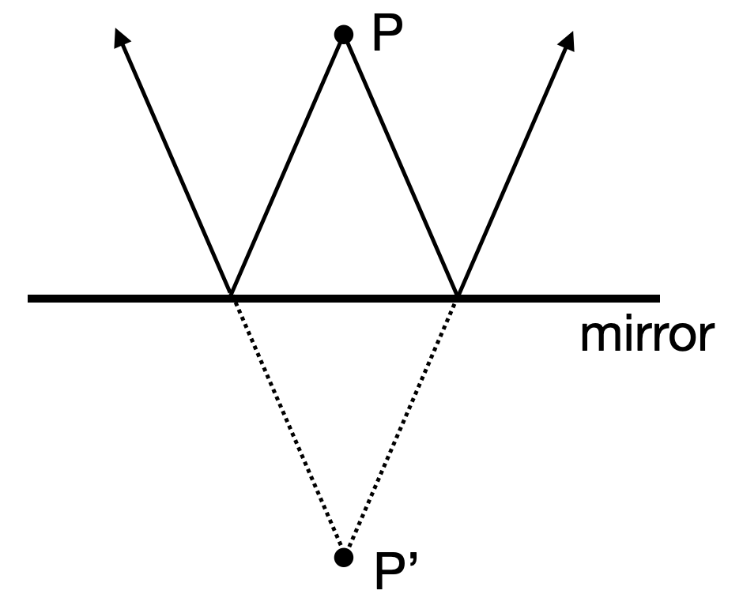
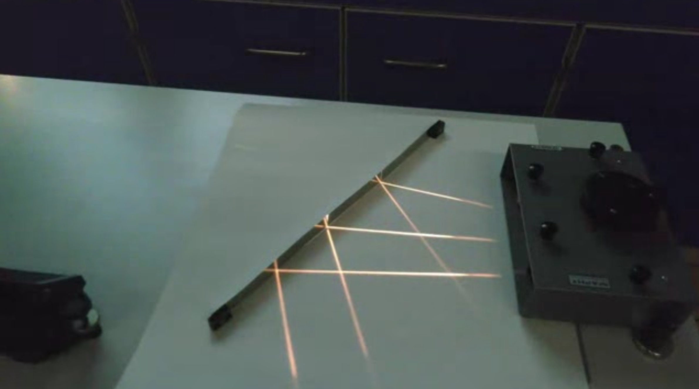
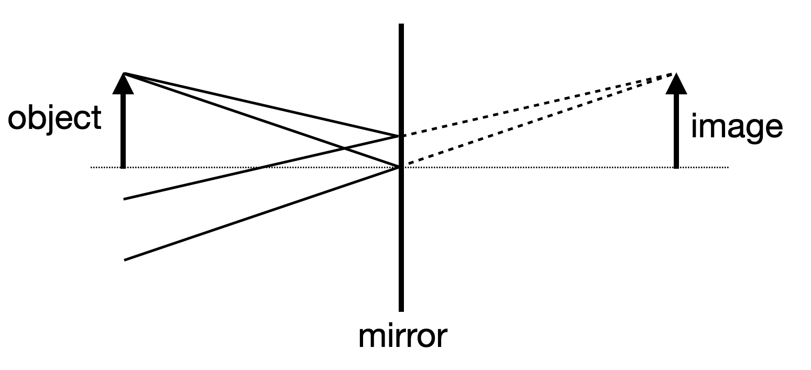
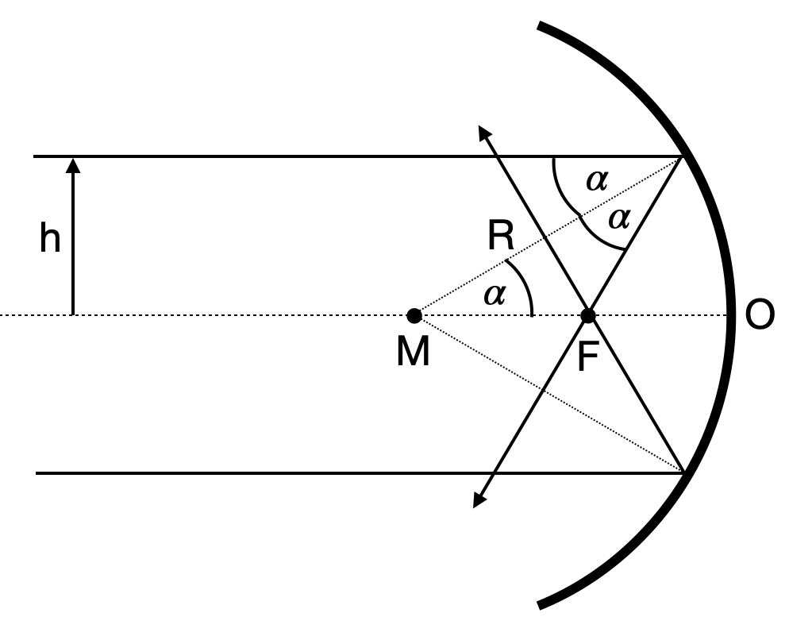
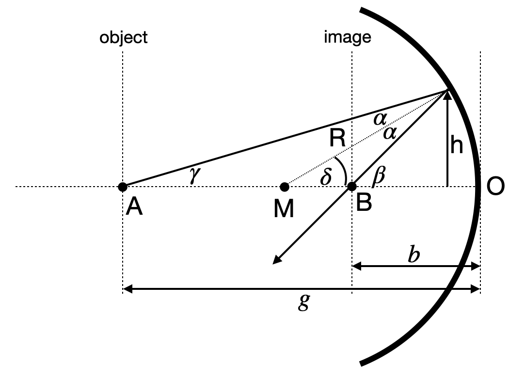
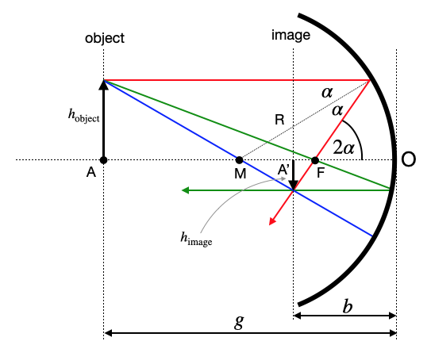

## Mirrors

### Plane Mirrors

When light radiates from a point $P$ and reflects off a mirror, as shown in the image, the reflected rays diverge but appear to originate from a point $P'$ located behind the mirror. According to the law of reflection, this image point is positioned at the same distance behind the mirror as the original object point is in front of it. As a result, an observer receiving these reflected rays, such as on their retina, perceives the point as if it were situated behind the mirror, even though no light actually travels behind the mirror surface.

::: {#fig-plane-mirror-combined layout-ncol=2}

{#fig-plane-mirror width="80%"}

{#fig-reflection-plane width="100%"}

Image formation on a plane mirror.
:::

When multiple points of an object emit light towards the mirror, this principle applies to each point. As a result, the entire object appears as an image behind the mirror. Since each point of the image is equidistant from the mirror as its corresponding object point, the image has the same size as the object. This leads to the definition of magnification as:

$$
M=\frac{h_{\text{image}}}{h_{\text{object}}}
$$

{#fig-plane-mirror width="60%" fig-align="center"}

::: {.callout-note}
## Virtual Images

A virtual image is an optical illusion where light rays appear to come from a point, but don't actually converge there. Unlike real images, virtual images can't be projected onto a screen. They're commonly seen in plane mirrors, convex mirrors, and when objects are closer to a lens than its focal point. **Remember: for virtual images, light rays only seem to originate from the image when traced backwards.**
:::

::: {.callout-note}
## Real Images

A real image forms when light rays actually meet at a point after reflection or refraction. These images can be projected onto a screen because light physically passes through the image location. Real images are often inverted and occur with concave mirrors and lenses when objects are beyond the focal point. **Key point: real images involve actual convergence of light rays.**
:::

### Concave Mirrors

For a concave mirror (where the reflecting surface is on the inside of the spherical curve), applying the law of reflection yields interesting results. Light rays parallel to the optical axis, at a distance $h$ from it, are reflected towards the axis and intersect it at a specific point $F$. Due to the mirror's symmetry, a parallel ray on the opposite side of the axis will also converge to this same point $F$.

{#fig-concave-mirror-ray width="60%" fig-align="center"}

We may calculate the position of the point $F$, e.g. the distance from the mirror surface point $O$, by applying the law of reflection. If the spherical mirror surface has a radius $R$, then the distance between the center of the sphere $M$ and the point $F$ is given by

$$FM=\frac{R}{2\cos(\alpha)}$$

Therefore, we can also calculate the distance of the mirror surface from the point $F$, which results in

\begin{equation}
OF=R\left (1-\frac{1}{2\cos(\alpha)}\right)=f
\end{equation}

This distance is the so-called focal length of the concave mirror $f$. For small angle $\alpha$, the above equation yields the so called paraxial limit (all angles are small and the rays are close to the optical axis). In this limit we find $\cos(\alpha)\approx 1$ and the focal length becomes $f=R/2$. If we replace the cosine function by
$\cos(\alpha)=\sqrt{1-\sin^2(\alpha)}$ with $\sin(\alpha)=h/R$, we find

\begin{equation}
f=R\left [ 1-\frac{R}{2\sqrt{R^2-h^2}}\right ]
\end{equation}

This equation is telling us, that the focal distance is not a single value for a concave mirror. The focal distance rather changes with the distance $h$ from the optical axis. If $h$ approaches $R$ the focal length become shorter.

::: {.callout-note collapse="true"}
## Focal Length of a Concave Spherical Mirror

::: {.cell execution_count=2}

::: {.cell-output .cell-output-display}
{#fig-spherical-mirror}
:::
:::

:::

To obtain now an equation which predicts the point at which the reflected ray intersects the optical axis if it emerged at a point $A$, we just consider the following sketch.

{#fig-concave-mirror width="60%" fig-align="center"}

For this situation, we can write down immediately the following relations

$$\delta=\alpha+\gamma$$

$$\gamma+\beta=2\delta$$

Further under the assumption of small angles ([paraxial approximation](Optical Elements III.qmd#paraxial-approximation)) we can write down

$$\tan(\gamma) \approx \gamma = \frac{h}{g}$$
$$\tan(\beta) \approx \beta = \frac{h}{b}$$
$$\sin(\delta) \approx \delta = \frac{h}{R}$$

from which we obtain

$$\frac{h}{g}+\frac{h}{b}=2\frac{h}{R}$$

and by divding by $h$ finally the imaging equation:

$$\frac{1}{g}+\frac{1}{b}= \frac{2}{R}= \frac{1}{f}$$

where we have used the focal length $f=R/2$. This equation has some surprising property. It is completely independent of $h$ and $\gamma$. That means all points in a plane at a distance $g$ are images into a plane at a distance $b$. Both planes are therefore called conjugated planes.

::: {.callout-note}
## Imaging Equation Concave Mirror

The sum of the inverse object and image distances equals the inverse focal length of the cocave mirror.

$$\frac{1}{g}+\frac{1}{b}\approx\frac{1}{f}$$
:::

This equation now helps to construct the image of an object in front of a concave mirror and we may define 3 different rays to identify the size of an image $h_{\text{image}}$ from the size of an object $h_{\text{object}}$.

{#fig-concave-mirror-image width="60%" fig-align="center"}

In the diagram above, three key rays are used to construct the image:

1. **Red ray:** Parallel to optical axis → reflects through focal point
2. **Green ray:** Through focal point → reflects parallel to optical axis
3. **Central ray:** Through center of curvature → reflects back along same path

The behavior of these reflected rays determines the nature of the image:

- If the rays intersect on the same side of the mirror as the object, a **real image** forms. This image is inverted, as shown in the sketch.
- If the rays diverge after reflection, they appear to intersect behind the mirror, creating a **virtual image**. This image is upright and located behind the mirror, though no actual ray intersection occurs.

The point where these rays meet (or appear to meet) determines the image size. By drawing a ray from the object's tip through the mirror's center (point O), we can easily determine the image height h_image. As an exercise, consider how this construction demonstrates that the magnification of a concave mirror is given by

$$ \frac{h_{\text{image}}}{h_{\text{object}}}=-\frac{b}{g}=M$$

This ratio indeed represents the magnification $M$. The negative sign in the expression reflects an important optical property: for real images formed by concave mirrors, the image is inverted relative to the object. This inversion is mathematically represented by the negative magnification value. Conversely, a positive magnification would indicate an upright image, which occurs with virtual images.

With the help of the imaging equation and the magnification we may in general differentiate between the following general situations:

| Object Distance | Image Characteristics | Image Position | Magnification |
|-----------------|----------------------|-----------------|---------------|
| $g > 2f$        | Real, inverted, smaller | Between f and 2f | $|m|$ < 1 |
| $g = 2f$        | Real, inverted, same size | At 2f | $|m|$ = 1 |
| $f < g < 2f$    | Real, inverted, larger | Beyond 2f | $|m|$ > 1 |
| $g = f$         | Image at infinity | At infinity | N/A |
| $g < f$         | Virtual, upright, larger | Behind mirror | $|m|$ > 1 |

::: {.callout-note collapse="true"}
## Parabolic Mirrors Focus Parallel Rays

We would like to show in the following, that a parabolic mirror is a shape which reflects all light rays parallel to the principal axis to a single point, the focus. This is a fundamental property of parabolic mirrors and is used in many optical systems, such as telescopes, satellite dishes, and car headlights.

For this purpose, we would like to use Fermat's principle. We examine a light ray originating from a point $x,y_0$ and travelling parallel to the principal axis. The light ray is reflected at a point $(x,y)$ on the mirror and travels to the focus at $(0,p)$. The light path is therefore consisting out of two linear segments $A$ and $B$ for which we have to calculate the time of travel. The total duration of the light's journey is then:
$$
t = t_A + t_B
$$

where:

  - $t_A$ is the time taken to travel from $x,y_0$ to the mirror.
  - $t_B$ is the time taken to travel from $(x,y)$ to $(0,p)$.

#### Time for Path A

The distance covered in path A is equal to $y_0 - y$, where $y$ represents the y-coordinate of the point where the ray meets the mirror. Consequently, the time taken for the light to traverse path A can be expressed as:

$$
t_A = \frac{y_0 - y}{c}
$$

In this equation, $c$ represents the speed of light in the medium.

#### Time for Path B

After reflection, the light ray travels from the point $(x, y)$ on the mirror's surface to the focal point located at $(0, p)$. The length of this segment of the path can be calculated using the distance formula:

$$
\sqrt{x^2 + (y - p)^2}
$$

Consequently, the time required for the light to traverse path B is expressed as:

$$
t_B = \frac{\sqrt{x^2 + (y - p)^2}}{c}
$$

#### Total Time

The total time for the light ray's journey is the sum of times for paths A and B:

$$
t = \frac{y_0 - y}{v} + \frac{\sqrt{x^2 + (y - p)^2}}{c}
$$

According to Fermat's principle, all light rays should take the same time. We can express this by setting the total time equal to a constant $t_c$:

$$
\frac{y_0 - y}{v} + \frac{\sqrt{x^2 + (y - p)^2}}{v} = t_c
$$

For a ray traveling along the y-axis, reflecting at $(0, 0)$, the total distance is $y_0 + p$. The time for this ray is:

$$
\frac{y_0 + p}{c}
$$

This gives us $t_c = \frac{y_0 + p}{c}$. Substituting into our general equation:

$$
\frac{y_0 - y}{v} + \frac{\sqrt{x^2 + (y - p)^2}}{c} = \frac{y_0 + p}{c}
$$

Multiplying by $c$ and rearranging:

$$
y_0 - y + \sqrt{x^2 + (y - p)^2} = y_0 + p
$$

$$
\sqrt{x^2 + (y - p)^2} = y + p
$$

Squaring both sides and simplifying:

$$
x^2 + (y - p)^2 = (y + p)^2
$$

$$
x^2 + y^2 - 2py + p^2 = y^2 + 2py + p^2
$$

$$
x^2 = 4py
$$

or

$$
y=\frac{1}{4p}x^2
$$

This final equation describes a parabola with its focus at $(0, p)$. The code below plots a parabolic mirror reflecting parallel rays to the focal point. Yet, I'm cheating a bit here. I'm not calculating the reflected rays, but just plotting them.

::: {.cell execution_count=3}

::: {.cell-output .cell-output-display}
{#fig-parabolic-mirror}
:::
:::

:::

::: {.callout-note collapse="true"}
## Elliptical Mirrors and Fermat's Principle

There is one interesting feature about elliptical mirrors: they can focus light from one focal point to the other. This is because the sum of the distances from any point on the ellipse to the two focal points is constant. This property is known as the **ellipse's geometric definition** and you can try that at home with a piece of string and two pins.

We can now apply Fermat's principle to proof that the light reflected from the ellipse travels a path length that is a saddle point. This means that the path length is stationary with respect to small perturbations in the path. Assuming for example that light travels from one focal point by a different path that is reflected from a line which is tangent to the ellipse at the point of reflection, the path length would be longer at any other point than the initial reflection point.

On the other side, if we reflect the ray on a surface that is a circle, which is intersecting the ellipse at the point of reflection, the path length would be shorter at any other point than the initial reflection point. This is a proof that the ellipse is a saddle point.

::: {.cell execution_count=4}

::: {.cell-output .cell-output-display}
{}
:::
:::

#### Mathematical Description

#### Ellipse Definition

Consider an ellipse with semi-major axis $a$ and semi-minor axis $b$, defined by:

$$\frac{x^2}{a^2} + \frac{y^2}{b^2} = 1$$

##### Focal Points

The focal points are located at $F_1(-c, 0)$ and $F_2(c, 0)$, where:

$$c^2 = a^2 - b^2$$

##### Path Length

Let $P(x_0, y_0)$ be a point on the ellipse. The total path length $L$ from $F_1$ to $F_2$ via $P$ is:

$$L = |F_1P| + |PF_2| = \sqrt{(x_0+c)^2 + y_0^2} + \sqrt{(x_0-c)^2 + y_0^2}$$

##### Fermat's Principle

The path length $L$ is stationary with respect to small perturbations in $P$:

$$\frac{\partial L}{\partial x_0} = 0 \quad \text{and} \quad \frac{\partial L}{\partial y_0} = 0 \quad \text{at the reflection point}$$

##### Tangent Line

The tangent line to the ellipse at $P(x_0, y_0)$ is given by:

$$\frac{x_0x}{a^2} + \frac{y_0y}{b^2} = 1$$

Let $Q$ be any point on this tangent line different from $P$. The path $F_1 \to Q \to F_2$ is longer than $F_1 \to P \to F_2$:

$$|F_1Q| + |QF_2| > |F_1P| + |PF_2|$$

##### Circle of Curvature

The radius of curvature $R$ at $P$ is:

$$R = \frac{(a^2b^2)^{3/2}}{(b^2x_0^2 + a^2y_0^2)^{3/2}}$$

The center of curvature $C$ is located at:

$$C = P + R\cdot\mathbf{n}$$

where $\mathbf{n}$ is the unit normal vector at $P$.

Let $Q$ be any point on this circle different from $P$. The path $F_1 \to Q \to F_2$ is shorter than $F_1 \to P \to F_2$:

$$|F_1Q| + |QF_2| < |F_1P| + |PF_2|$$

As a consequence, the path length for the reflection on and ellipse between the two focal points must be a saddle point.
:::

