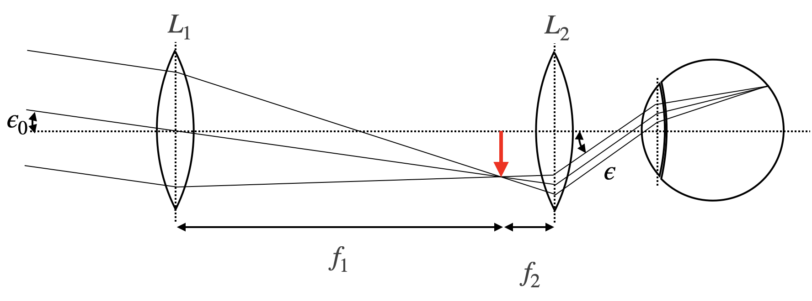
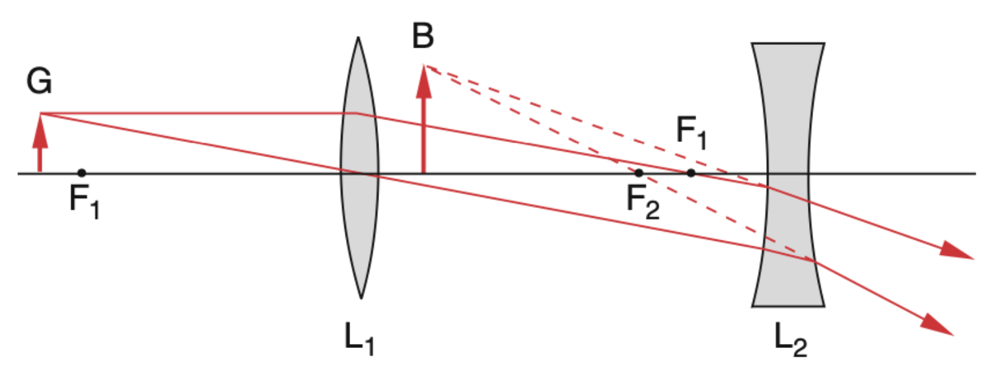
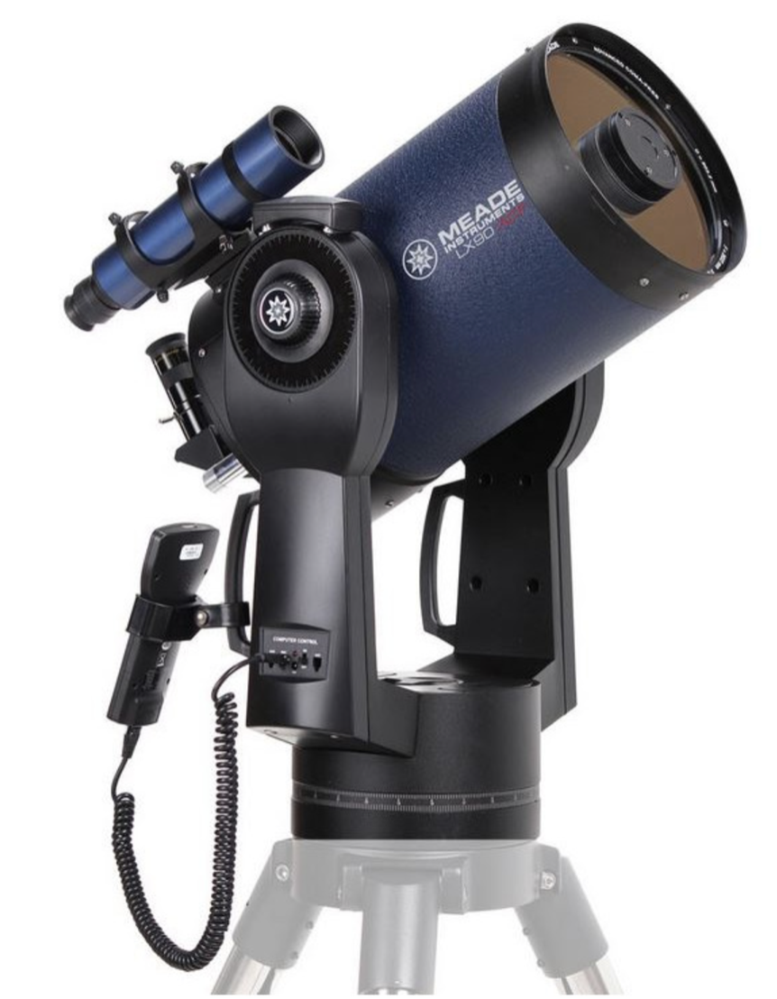
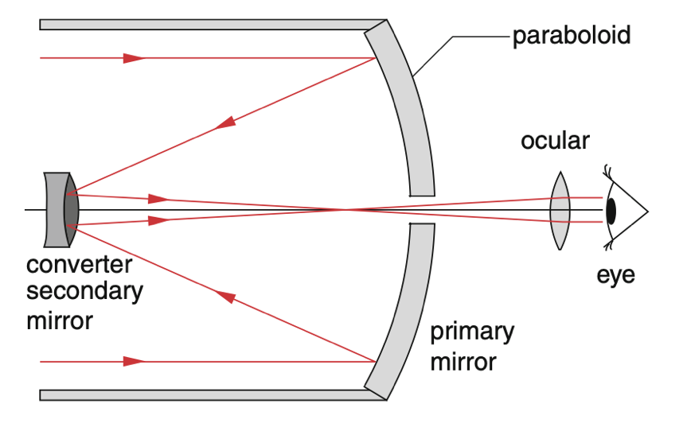
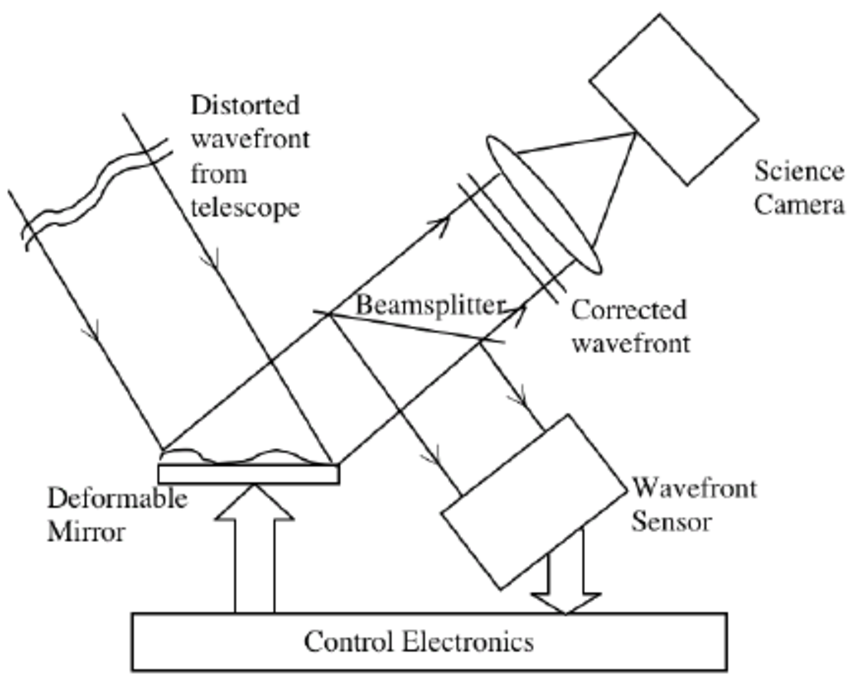
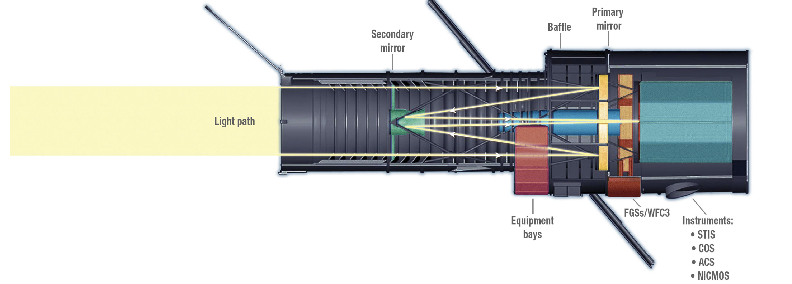

Other than the microscope, the telescope is made to observe distant objects, which would appear under a very small observation angle. This can be achieved with different optical designs. The most common telescopes are refracting telescopes, which use lenses to magnify the angle under which the object is observed. The second type of telescopes are reflecting telescopes, which use mirrors to magnify the angle under which the object is observed.

### Refracting Telescopes

The telescope is therefore made to magnify the angle under which the object is observed. In the same way as a microscope, the telescope consists of two lenses with the focal distances $f_1,f_2$.

{width=60%}

As indicated in the sketch above, the first lens generates an image at the focal length of the first lens. This intermediate image is the magnified by an eye-piece as well acting as a magnifying glass. We may therefore apply the same kind of techniques as earlier for the calculation of the angular magnification. The angle of observation for the object of size $D$ is given by

$$
2\epsilon_0=\frac{D}{f_1}
$$

while the angle of observation through the telescope is given as

$$
2\epsilon=\frac{D}{f_2}
$$

Correspondingly, the angular magnification is given by

$$
V=\frac{\epsilon}{\epsilon_0}=\frac{D}{f_2}\frac{f_1}{D}=\frac{f_1}{f_2}
$$

The magnification is therefore given by the ration of the focal length of the entrance lens and the eye-piece. The above telescope is also termed **astronomical telescope** or **Kepler telescope**, since it has been used for astromical observations. It creates an image which is reversed.

A telescope with an upright image may be created with the help of a concave lens. This type of telescope is called Galilei telescope and obeyes the same magnification formula as above. Due to the fact that a concave lens has a negative focal length, the total magnification will be negative as well being indicative for an upright image.

#### Light Gathering Power

While magnification is important for resolving details in celestial objects, the ability to collect light is equally crucial for observing faint astronomical objects. The light gathering power of a telescope is determined by the area of its objective lens or primary mirror, which scales with the square of the aperture diameter. A telescope with an aperture diameter $D$ collects light proportional to $\pi D^2/4$. This means that doubling the diameter of a telescope increases its light gathering ability by a factor of four. For example, a telescope with a 200 mm aperture collects four times as much light as a 100 mm telescope, making it possible to observe objects that are significantly fainter.

::: {.callout-note}
## Magnification vs. Aperture
While high magnification might seem desirable, it is the aperture size that fundamentally limits what a telescope can observe. Magnifying a dim image beyond what the aperture can support only results in a larger but dimmer image. Professional observatories therefore prioritize large apertures to maximize light collection.
:::

#### Exit Pupil

An important practical consideration when using a telescope is the exit pupil, which is the diameter of the light beam that exits the eyepiece and enters the observer's eye. The exit pupil diameter can be calculated as the ratio of the objective diameter to the magnification:

$$
D_{exit} = \frac{D_{objective}}{V}
$$

For comfortable viewing, the exit pupil should ideally match the diameter of the observer's eye pupil. The human eye pupil varies from about 2 mm in bright light to 7 mm in dark-adapted conditions. If the exit pupil is larger than the eye's pupil, some light is wasted. If it is too small, the image may appear dim and the full aperture of the telescope is not effectively utilized. This relationship shows that for a given telescope, there is an optimal range of magnifications for visual observation.

{width=60%}

### Reflecting Telescopes

Modern powerful telescopes also use mirrors instead of refracting optical elements, as reflecting elements with nearly 100 percent reflectivity can be built with a much smaller mass than large glass elements. Such telescopes come in different setups. The one below is a Cassegrain telescope, where a secondary convex miror is used for imaging the intermediate image to the eye.

::: {layout-ncol=2}
{width=20%}

{width=100%}
:::

#### Other Reflecting Telescope Designs

Beyond the Cassegrain design, several other reflecting telescope configurations are commonly used, each with its own advantages. The **Newtonian telescope**, designed by Isaac Newton in 1668, is perhaps the simplest reflecting telescope design. It uses a parabolic primary mirror that reflects light to a small flat secondary mirror positioned at 45 degrees near the front of the tube. This secondary mirror directs the light to an eyepiece mounted on the side of the telescope tube. The Newtonian design is popular among amateur astronomers due to its simplicity and cost-effectiveness for large apertures.

The **Schmidt-Cassegrain telescope** combines both refracting and reflecting elements. It uses a spherical primary mirror and a corrector plate (a thin aspherical lens) at the front of the telescope to correct for spherical aberration. A secondary convex mirror reflects the light back through a hole in the primary mirror. This hybrid design creates a very compact telescope that is easy to transport while maintaining a long effective focal length, making it popular for both amateur and professional applications.

The **Ritchey-Chrétien telescope** is a specialized variant of the Cassegrain design that uses hyperbolic primary and secondary mirrors instead of parabolic mirrors. This configuration eliminates coma, an optical aberration that causes off-axis points to appear comet-shaped. The Hubble Space Telescope and many large professional observatories use this design because it provides sharp images across a wider field of view compared to classical Cassegrain telescopes.

### Telescope Mounts

The mechanical mount that supports a telescope is as important as the optical system itself, particularly for astronomical observations where the Earth's rotation causes celestial objects to move across the sky. Two primary types of telescope mounts are used. The **alt-azimuth mount** allows the telescope to move in altitude (up and down) and azimuth (left and right), similar to a camera tripod. While simple and stable, this design requires simultaneous adjustment of both axes to track celestial objects as they move across the sky.

The **equatorial mount** is specifically designed for astronomical tracking. One axis, called the polar axis, is aligned parallel to Earth's rotation axis, while the other axis is perpendicular to it. This configuration allows the telescope to track celestial objects by rotating around only the polar axis at a constant rate matching Earth's rotation. Modern equatorial mounts are often equipped with computerized tracking systems that automatically follow celestial objects and can even locate and point to thousands of objects in their databases. Many large professional telescopes now use computer-controlled alt-azimuth mounts, as modern computing power can easily calculate the required dual-axis movements for tracking while benefiting from the mount's greater mechanical stability.

### Adaptive Optics

When observing objects from the ground, the atmosphere can distort the image. This is due to the fact that the atmosphere is not homogeneous and the refractive index of the air is changing with time. This leads to a distortion of the image, which can be corrected with the help of adaptive optics. The principle of adaptive optics is to measure the distortion of the image with the help of a laser beam and to correct the image with the help of a deformable mirror. The deformable mirror is a mirror with a number of actuators, which can change the shape of the mirror in order to correct the distortion of the image. The principle of adaptive optics is shown in the figure below.

{width=50%}

### Space-Based Telescopes

Placing telescopes in space eliminates atmospheric interference completely. The Hubble Space Telescope revolutionized astronomy with its crystal-clear views of the universe.

{width=100%}

Its successor, the James Webb Space Telescope (launched in 2021), operates in the infrared spectrum and can peer even further into space and time. Being above the atmosphere not only provides clearer images but also allows these telescopes to observe wavelengths that are normally blocked by Earth's atmosphere, particularly in the infrared and ultraviolet regions.

### Beyond Optical Telescopes

While the principles discussed above apply primarily to optical telescopes that observe visible light, it is worth noting that telescopes exist for other regions of the electromagnetic spectrum as well. Radio telescopes, for example, use large parabolic dishes to collect and focus radio waves from cosmic sources. These instruments operate on the same basic ray optics principles as reflecting optical telescopes, with the dish acting as the primary mirror. Radio telescope arrays, such as the Very Large Array (VLA) or the Atacama Large Millimeter Array (ALMA), combine signals from multiple dishes using interferometry techniques to achieve extremely high effective apertures. Unlike optical telescopes, radio telescopes can observe through clouds and during daytime, and they reveal phenomena invisible to optical instruments, such as the radio emission from pulsars and the cosmic microwave background radiation.
