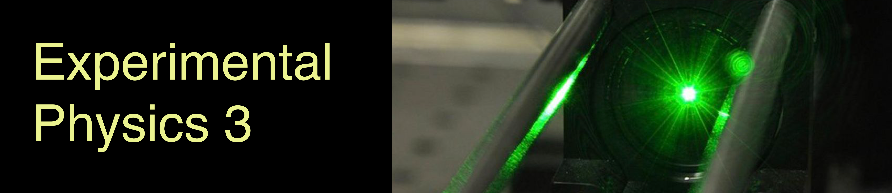

# Welcome to the Experimental Physics 3 Course!

In this Experimental Physics 3 course, we will explore fundamental experiments and mathematical descriptions related to light propagation, electromagnetic waves, and their material counterpart, matter waves. Specifically, we will focus on:

- Geometrical Optics
- Wave Optics
- Electromagnetic Waves
- Matter Waves and Quantum Mechanics

The fields of optics and quantum mechanics are currently vibrant areas of research, with rapidly evolving optical technologies, high-resolution microscopy, and quantum information science. All of these advancements build upon the foundations that we will address in this course.

## Course Participation

::: {.cell execution_count=1}

::: {.cell-output .cell-output-display}
{#fig-participation}
:::
:::

## Seminar Participation

::: {.cell execution_count=2}

::: {.cell-output .cell-output-display}
{#fig-participation_seminar}
:::
:::

## Submitted Homeworks

::: {.cell execution_count=3}

::: {.cell-output .cell-output-display}
{#fig-submitted}
:::
:::

## Average Points of Total

::: {.cell execution_count=4}

::: {.cell-output .cell-output-display}
{#fig-points}
:::
:::

## Homework Statistics

::: {.cell execution_count=5}

::: {.cell-output .cell-output-display}
{#fig-homework-stats}
:::
:::

