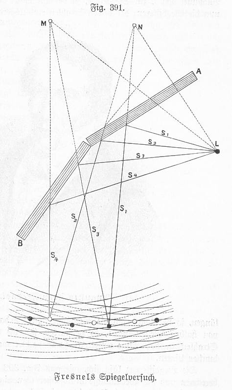
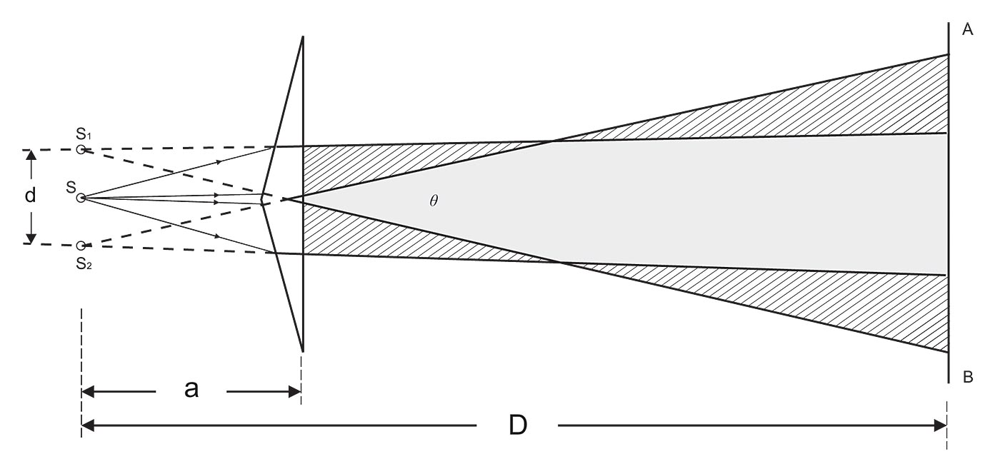

```{python}
#| echo: false

import numpy as np
import matplotlib.pyplot as plt

from time import sleep,time
from ipycanvas import MultiCanvas, hold_canvas,Canvas
import matplotlib as mpl
import matplotlib.cm as cm
from matplotlib.patches import Arc
from matplotlib.transforms import Bbox, IdentityTransform, TransformedBbox


class AngleAnnotation(Arc):
    """
    Draws an arc between two vectors which appears circular in display space.
    """
    def __init__(self, xy, p1, p2, size=75, unit="points", ax=None,
                 text="", textposition="inside", text_kw=None, **kwargs):
        """
        Parameters
        ----------
        xy, p1, p2 : tuple or array of two floats
            Center position and two points. Angle annotation is drawn between
            the two vectors connecting *p1* and *p2* with *xy*, respectively.
            Units are data coordinates.

        size : float
            Diameter of the angle annotation in units specified by *unit*.

        unit : str
            One of the following strings to specify the unit of *size*:

            * "pixels": pixels
            * "points": points, use points instead of pixels to not have a
              dependence on the DPI
            * "axes width", "axes height": relative units of Axes width, height
            * "axes min", "axes max": minimum or maximum of relative Axes
              width, height

        ax : `matplotlib.axes.Axes`
            The Axes to add the angle annotation to.

        text : str
            The text to mark the angle with.

        textposition : {"inside", "outside", "edge"}
            Whether to show the text in- or outside the arc. "edge" can be used
            for custom positions anchored at the arc's edge.

        text_kw : dict
            Dictionary of arguments passed to the Annotation.

        **kwargs
            Further parameters are passed to `matplotlib.patches.Arc`. Use this
            to specify, color, linewidth etc. of the arc.

        """
        self.ax = ax or plt.gca()
        self._xydata = xy  # in data coordinates
        self.vec1 = p1
        self.vec2 = p2
        self.size = size
        self.unit = unit
        self.textposition = textposition

        super().__init__(self._xydata, size, size, angle=0.0,
                         theta1=self.theta1, theta2=self.theta2, **kwargs)

        self.set_transform(IdentityTransform())
        self.ax.add_patch(self)

        self.kw = dict(ha="center", va="center",
                       xycoords=IdentityTransform(),
                       xytext=(0, 0), textcoords="offset points",
                       annotation_clip=True)
        self.kw.update(text_kw or {})
        self.text = ax.annotate(text, xy=self._center, **self.kw)

    def get_size(self):
        factor = 1.
        if self.unit == "points":
            factor = self.ax.figure.dpi / 72.
        elif self.unit[:4] == "axes":
            b = TransformedBbox(Bbox.unit(), self.ax.transAxes)
            dic = {"max": max(b.width, b.height),
                   "min": min(b.width, b.height),
                   "width": b.width, "height": b.height}
            factor = dic[self.unit[5:]]
        return self.size * factor

    def set_size(self, size):
        self.size = size

    def get_center_in_pixels(self):
        """return center in pixels"""
        return self.ax.transData.transform(self._xydata)

    def set_center(self, xy):
        """set center in data coordinates"""
        self._xydata = xy

    def get_theta(self, vec):
        vec_in_pixels = self.ax.transData.transform(vec) - self._center
        return np.rad2deg(np.arctan2(vec_in_pixels[1], vec_in_pixels[0]))

    def get_theta1(self):
        return self.get_theta(self.vec1)

    def get_theta2(self):
        return self.get_theta(self.vec2)

    def set_theta(self, angle):
        pass

    # Redefine attributes of the Arc to always give values in pixel space
    _center = property(get_center_in_pixels, set_center)
    theta1 = property(get_theta1, set_theta)
    theta2 = property(get_theta2, set_theta)
    width = property(get_size, set_size)
    height = property(get_size, set_size)

    # The following two methods are needed to update the text position.
    def draw(self, renderer):
        self.update_text()
        super().draw(renderer)

    def update_text(self):
        c = self._center
        s = self.get_size()
        angle_span = (self.theta2 - self.theta1) % 360
        angle = np.deg2rad(self.theta1 + angle_span / 2)
        r = s / 2
        if self.textposition == "inside":
            r = s / np.interp(angle_span, [60, 90, 135, 180],
                                          [3.3, 3.5, 3.8, 4])
        self.text.xy = c + r * np.array([np.cos(angle), np.sin(angle)])
        if self.textposition == "outside":
            def R90(a, r, w, h):
                if a < np.arctan(h/2/(r+w/2)):
                    return np.sqrt((r+w/2)**2 + (np.tan(a)*(r+w/2))**2)
                else:
                    c = np.sqrt((w/2)**2+(h/2)**2)
                    T = np.arcsin(c * np.cos(np.pi/2 - a + np.arcsin(h/2/c))/r)
                    xy = r * np.array([np.cos(a + T), np.sin(a + T)])
                    xy += np.array([w/2, h/2])
                    return np.sqrt(np.sum(xy**2))

            def R(a, r, w, h):
                aa = (a % (np.pi/4))*((a % (np.pi/2)) <= np.pi/4) + \
                     (np.pi/4 - (a % (np.pi/4)))*((a % (np.pi/2)) >= np.pi/4)
                return R90(aa, r, *[w, h][::int(np.sign(np.cos(2*a)))])

            bbox = self.text.get_window_extent()
            X = R(angle, r, bbox.width, bbox.height)
            trans = self.ax.figure.dpi_scale_trans.inverted()
            offs = trans.transform(((X-s/2), 0))[0] * 72
            self.text.set_position([offs*np.cos(angle), offs*np.sin(angle)])

plt.rcParams.update({'font.size': 10,
                     'lines.linewidth': 1,
                     'lines.markersize': 5,
                     'axes.labelsize': 10,
                     'axes.labelpad':0,
                     'xtick.labelsize' : 9,
                     'ytick.labelsize' : 9,
                     'legend.fontsize' : 8,
                     'contour.linewidth' : 1,
                     'xtick.top' : True,
                     'xtick.direction' : 'in',
                     'ytick.right' : True,
                     'ytick.direction' : 'in',
                     'figure.figsize': (4, 3),
                     'axes.titlesize':8})

def get_size(w,h):
    return((w/2.54,h/2.54))

```

The double slit experiment stands as one of the most elegant and profound demonstrations in all of physics. First performed by Thomas Young in 1801, this experiment provided compelling evidence for the wave nature of light, challenging the prevailing corpuscular theory championed by Newton. Young's observation of interference fringes—alternating bright and dark bands on a screen—could only be explained if light behaved as a wave, capable of interfering constructively and destructively. This single experiment fundamentally changed our understanding of light and laid the groundwork for wave optics.

Beyond its historical significance, the double slit experiment reveals principles that are essential for modern technology. The same physics governs how we design diffraction gratings for spectroscopy, how we understand the resolution limits of microscopes and telescopes, and how we engineer photonic devices for telecommunications. Even more remarkably, the double slit experiment continues to surprise us in quantum mechanics, where individual photons or electrons create interference patterns that challenge our intuitions about the nature of reality itself.

## Two Point Sources: The Foundation of Double Slit Interference

The interference pattern we observe in the double slit experiment arises from the superposition of waves emanating from two coherent point sources. We can model the double slit as two such sources separated by a distance $d$, each emitting spherical waves with the same wavelength $\lambda$ and amplitude. When these waves overlap in space, they interfere according to the principle of superposition, creating regions of constructive interference (bright fringes) where the waves arrive in phase, and regions of destructive interference (dark fringes) where they arrive out of phase.

The key to understanding the interference pattern lies in calculating the path difference between the two waves as they travel from the slits to any point on an observation screen. This path difference determines the relative phase of the waves at that point, which in turn determines whether we observe constructive or destructive interference.


::: {layout-ncol=2}
```{python}
# | code-fold: true
# | fig-cap: Double slit interference as the interference from two point sources on the left and the wave amplitudes on the right. The interference pattern is created by two point sources that emit waves with the same wavelength and amplitude. The intereference of the two waves depends then on the path length difference between the two waves.

def plot_angle(ax, pos, angle, length=0.95, acol="C0", **kwargs):
    vec2 = np.array([np.cos(np.deg2rad(angle)), np.sin(np.deg2rad(angle))])
    xy = np.c_[[length, 0], [0, 0], vec2*length].T + np.array(pos)
    ax.plot(*xy.T, color=acol,ls="--")
    return AngleAnnotation(pos, xy[0], xy[2], ax=ax, **kwargs)


plt.figure(figsize=get_size(12,12))

# Point sources positions
d = 2  # source separation
y1, z1 = 0, -d/2  # source 1
y2, z2 = 0, d/2   # source 2

# Draw circular wavefronts
theta = np.linspace(0, 2*np.pi, 100)
n_circles = 5
wavelength = 2  # spacing between wavefronts

for i in range(n_circles):
    r = i * wavelength
    # Wavefronts from source 1
    plt.plot(r*np.cos(theta) + y1, r*np.sin(theta) + z1, 'b:', alpha=0.5)
    # Wavefronts from source 2
    plt.plot(r*np.cos(theta) + y2, r*np.sin(theta) + z2, 'r:', alpha=0.5)

# Draw screen
screen_z = np.linspace(-10, 10, 100)
screen_y = np.ones_like(screen_z) * 16
plt.plot(screen_y, screen_z, 'k-', linewidth=2, label='Screen')

# Example point on screen
P = np.array([16, 4])  # point coordinates [y, z]

# Draw paths from sources to point P
plt.plot([y1, P[0]], [z1, P[1]], 'b-', label='Path 1')
plt.plot([y2, P[0]], [z2, P[1]], 'r-', label='Path 2')
plt.plot([0, P[0]], [z2, P[1]], 'k-', label='Path 2')

# Calculate and show path lengths
r1 = np.sqrt((P[0]-y1)**2 + (P[1]-z1)**2)
r2 = np.sqrt((P[0]-y2)**2 + (P[1]-z2)**2)
path_diff = abs(r2 - r1)

# Add sources
plt.plot(y1, z1, 'bo', label='Source 1')
plt.plot(y2, z2, 'ro', label='Source 2')

# Label source separation
plt.plot([y1-0.5, y1-0.5], [z1, z2], 'k-', linewidth=1)
plt.text(y1-2, -.2, 'd', fontsize=12)

# Add angle annotation
center = np.array([0, 0])  # center between sources
angle = np.arctan2(P[1], P[0])  # angle to point P
kw = dict(size=500, unit="points", text=r"$\theta$")
plot_angle(plt.gca(), center, angle*180/np.pi, length=16,acol="k",textposition="inside", **kw)

plt.xlabel('y')
plt.ylabel('z')
plt.axis("equal")
plt.axis('off')

plt.show()
```


```{=html}
<head>
    <title>Wave Interference Pattern</title>
    <script src="https://d3js.org/d3.v7.min.js"></script>
    <style>
        .container {
            display: flex;
            flex-direction: column;
            align-items: center;
            gap: 20px;
        }
    </style>
</head>
<body>
<div class="container">
    <div id="plot"></div>
    <div>
        <label for="separation">Source Separation: </label>
        <input type="range" id="separation" min="0.0" max="3.0" value="1" step="0.1">
    </div>
    <div>
        <label for="separation">Wavelength: </label>
        <input type="range" id="wavelength" min="0.2" max="1.0" value="0.532" step="0.01">
    </div>
</div>

<script>
// Set up the dimensions
const width = 300;
const height = 300;
const margin = { top: 20, right: 20, bottom: 20, left: 20 };

// Wave parameters
let wavelength = 0.532;
const amplitude = 1;
let k = 2 * Math.PI / (wavelength*100);
let separation = (1.0*100);

// Create the SVG container
const svg = d3.select("#plot")
    .append("svg")
    .attr("width", width)
    .attr("height", height);

// Create a group for the heatmap
const heatmapGroup = svg.append("g")
    .attr("transform", `translate(${margin.left}, ${margin.top})`);

// Create color scale
const colorScale = d3.scaleSequential(d3.interpolateRdBu)
    .domain([-0.3, 0.3]);

// Create grid data
const gridSize = 200;
const cellWidth = (width - margin.left - margin.right) / gridSize;
const cellHeight = (height - margin.top - margin.bottom) / gridSize;

function calculateWaveAmplitude(x, y, sourceX1, sourceX2) {
    const r1 = Math.sqrt((x - sourceX1) ** 2 + (y - height/2) ** 2);
    const r2 = Math.sqrt((x - sourceX2) ** 2 + (y - height/2) ** 2);

    // Calculate wave amplitudes
    const wave1 = amplitude * Math.cos(k * r1) / Math.sqrt(Math.max(r1, 1));
    const wave2 = amplitude * Math.cos(k * r2) / Math.sqrt(Math.max(r2, 1));

    return wave1 + wave2;
}

function updateHeatmap() {
    const sourceX1 = width/2 - separation/2;
    const sourceX2 = width/2 + separation/2;

    const cells = [];
    for (let i = 0; i < gridSize; i++) {
        for (let j = 0; j < gridSize; j++) {
            const x = i * cellWidth + margin.left;
            const y = j * cellHeight + margin.top;
            const amplitude = calculateWaveAmplitude(x, y, sourceX1, sourceX2);
            cells.push({
                x: x,
                y: y,
                amplitude: amplitude
            });
        }
    }

    // Update heatmap
    const rects = heatmapGroup.selectAll("rect")
        .data(cells);

    rects.enter()
        .append("rect")
        .merge(rects)
        .attr("x", d => d.x)
        .attr("y", d => d.y)
        .attr("width", cellWidth)
        .attr("height", cellHeight)
        .attr("fill", d => colorScale(d.amplitude));

    rects.exit().remove();

    // Draw source points
    heatmapGroup.selectAll(".source")
        .data([sourceX1, sourceX2])
        .join("circle")
        .attr("class", "source")
        .attr("cx", d => d)
        .attr("cy", height/2)
        .attr("r", 5)
        .attr("fill", "black");
}

// Initial render
updateHeatmap();

// Add slider interaction
d3.select("#separation").on("input", function() {
    separation = +this.value*100;
    updateHeatmap();
});

d3.select("#wavelength").on("input", function() {
    wavelength = +this.value;
    k = 2 * Math.PI / (wavelength*100);
    updateHeatmap();
});

</script>
</body>
```

:::


### Calculating the Path Difference and Phase Shift

To understand where bright and dark fringes appear on the screen, we need to calculate how the path difference between the two waves varies with position. Consider light traveling from the two slits to a point on a distant screen at angle $\theta$ from the central axis. When the screen is far away compared to the slit separation (the Fraunhofer or far-field regime), we can approximate the two paths as nearly parallel rays. In this approximation, the geometric path difference is simply the projection of the slit separation onto the direction of propagation.

::: {.callout-important}
## Path Difference and Phase Difference Formulas
**Path difference:**
$$\Delta s = d \sin(\theta)$$

**Phase difference:**
$$\Delta \phi = \frac{2\pi}{\lambda} \Delta s = \frac{2\pi d}{\lambda} \sin(\theta)$$

where:

- $d$ = separation between the two slits
- $\theta$ = angle from the central axis to the observation point
- $\lambda$ = wavelength of light

**Physical meaning:** Light from the upper slit travels a distance $d\sin(\theta)$ farther than light from the lower slit. This extra distance translates directly into a phase shift that determines the interference pattern.
:::

The path difference formula $\Delta s = d\sin(\theta)$ is fundamental and remarkably simple, yet it encapsulates the entire geometry of the double slit experiment. When $\theta = 0$ (directly ahead, on the central axis), both waves travel the same distance and arrive in phase, creating the bright central maximum. As we move to larger angles, the path difference increases, and the waves alternately come into and out of phase, creating the characteristic fringe pattern.

::: {.callout-note collapse=true}
## The Fraunhofer Approximation
The path length difference formula $\Delta s = d\sin(\theta)$ given above is an approximation valid in the far-field or **Fraunhofer limit**. The exact calculation requires careful geometry: for two sources at positions $z_1 = -d/2$ and $z_2 = d/2$, and a point P at distance $L$ from the center with screen coordinate $y_P$, the exact path lengths are:

$$r_1 = \sqrt{L^2 + (y_P + d/2)^2}, \quad r_2 = \sqrt{L^2 + (y_P - d/2)^2}$$

The exact path difference is $\Delta s = r_2 - r_1$. The approximation $\Delta s \approx d\sin(\theta)$ becomes accurate when the screen distance $L$ is much larger than both the slit separation $d$ and the observation height $y_P$. Mathematically, we require $L \gg d$ and $L \gg y_P$.

Interestingly, if we place a lens at one focal length from the screen (as is commonly done in optical systems), the two paths become exactly parallel rays, and our simple formula $\Delta s = d\sin(\theta)$ is exact rather than approximate. This is why many practical interferometric setups use lenses to create well-defined far-field patterns.
:::

### Conditions for Constructive and Destructive Interference

Armed with the phase difference formula, we can now determine where bright and dark fringes appear. Constructive interference—where the waves add coherently to create maximum intensity—occurs whenever the phase difference is an integer multiple of $2\pi$. This corresponds to path differences that are integer multiples of the wavelength, meaning the waves arrive perfectly in phase. Setting $\Delta\phi = 2\pi m$ where $m$ is an integer, we obtain the condition for bright fringes.

::: {.callout-important}
## Interference Conditions for Double Slit

**Constructive interference (bright fringes):**
$$\sin(\theta_m) = m \frac{\lambda}{d}, \quad m = 0, \pm 1, \pm 2, \pm 3, \ldots$$

**Destructive interference (dark fringes):**
$$\sin(\theta_m) = \left(m + \frac{1}{2}\right) \frac{\lambda}{d}, \quad m = 0, \pm 1, \pm 2, \pm 3, \ldots$$

where $m$ is called the **order** of the interference fringe.

**Key insights:**

- The $m=0$ order is the **central maximum** directly ahead ($\theta = 0$)
- Higher orders ($m = \pm 1, \pm 2, ...$) appear symmetrically on either side
- The angular spacing between fringes scales as $\lambda/d$
- Smaller slit separation $d$ → wider spacing between fringes
- Shorter wavelength $\lambda$ → narrower spacing between fringes

**Universal principle:** This $\lambda/d$ scaling appears throughout optics—in diffraction gratings, antenna arrays, and spectroscopy. It's the fundamental relationship connecting wavelength to spatial resolution and is the foundation of spectroscopic analysis.
:::

The constructive interference condition reveals something profound: the angular positions of the bright fringes are determined entirely by the ratio $\lambda/d$. This has immediate practical consequences. If we use the double slit as a spectrometer and shine white light (containing multiple wavelengths) through it, different wavelengths will produce bright fringes at different angles. By measuring these angles, we can determine the wavelengths present in the light—this is the basis of grating spectroscopy, one of the most important analytical techniques in science.

### Intensity Distribution

While the interference conditions tell us where the bright and dark fringes are located, we can calculate the complete intensity distribution by applying the general interference formula. If the screen is at distance $L$ from the slits, the angle can be calculated as $\theta = \arctan(y/L)$, where $y$ is the position on the screen measured from the center. For small angles (when $y \ll L$), we can use the approximation $\sin(\theta) \approx \tan(\theta) = y/L$.

The total intensity at any point on the screen is found by adding the contributions from both slits and accounting for their relative phase:

$$
I = I_1 + I_2 + 2\sqrt{I_1 I_2}\cos(\Delta\phi) = I_1 + I_2 + 2\sqrt{I_1 I_2}\cos\left(\frac{2\pi d}{\lambda}\sin(\theta)\right)
$$

When both slits have equal intensity ($I_1 = I_2 = I_0$), this simplifies to the elegant form:

::: {.callout-tip}
## Double Slit Intensity Formula
$$I(\theta) = 4I_0\cos^2\left(\frac{\pi d}{\lambda}\sin(\theta)\right)$$

where $I_0$ is the intensity from a single slit.

**Maximum intensity:** $I_{\text{max}} = 4I_0$ (four times single-slit intensity)

**Minimum intensity:** $I_{\text{min}} = 0$ (complete destructive interference)

The factor of 4 enhancement at constructive interference comes from the coherent addition of amplitudes: two identical waves adding in phase give twice the amplitude, which corresponds to four times the intensity.
:::

The figure below shows this intensity pattern for two slits separated by $d = 2$ µm illuminated with green light of wavelength $\lambda = 532$ nm. The characteristic feature is the periodic array of sharp bright fringes separated by completely dark regions.

```{python}
# | code-fold: true
#| fig-cap: Intensity pattern of two sources at a screen at a distance L. The sources are separated by a distance d and the wavelength of the waves is $\lambda$.

# Plot intensity pattern
L = 16  # screen distance
y = np.linspace(-20, 20, 1000)  # screen positions
theta = np.arctan(y/L)  # angles
wavelength = 0.532  # wavelength in micrometers
d = 2  # source separation

# Calculate phase difference
delta_phi = (2*np.pi/wavelength) * d * np.sin(theta)

# Calculate intensity (assuming I1 = I2 = 1)
I = 2 * (1 + np.cos(delta_phi))

plt.figure(figsize=get_size(10,6))
plt.plot(y, I)
plt.xlabel('position y on screen')
plt.ylabel('intensity ')
plt.grid(True, alpha=0.3)
plt.show()
```

## Application: Optical Resolution and Imaging

The physics of two-source interference has profound implications for the resolution of optical instruments—the fundamental limit on how closely spaced two objects can be and still be distinguished as separate. This connection between interference and resolution was recognized by Ernst Abbe in the 1870s and forms the theoretical foundation for modern microscopy.

Consider two point sources (such as two stars viewed through a telescope, or two fluorescent molecules under a microscope). Each source produces its own diffraction pattern, and these patterns overlap on the detector. When the sources are far apart, their patterns are well separated and easily distinguished. But as we bring them closer together, their patterns overlap more and more. Eventually, they become so close that we can no longer tell whether we're seeing two sources or just one extended source.

The **Rayleigh criterion** provides a practical definition of resolution: two sources are considered "just resolved" when the central maximum of one diffraction pattern falls on the first minimum of the other. For a circular aperture (like most telescope and microscope objectives), this leads to a minimum resolvable angular separation of:

::: {.callout-important collapse=true}
## Optical Resolution Limits

**Rayleigh criterion (angular resolution):**

In one of our later lectures we will discuss the derivation of this formula.

$$\theta_{\text{min}} = 1.22\frac{\lambda}{D}$$

where $D$ is the diameter of the aperture (lens or mirror).

**Abbe diffraction limit (spatial resolution):**
$$d_{\text{min}} = \frac{\lambda}{2n\sin(\theta)} = \frac{\lambda}{2\text{NA}}$$

where:

- $n$ = refractive index of the medium
- $\theta$ = half-angle of the cone of light collected by the objective
- NA = $n\sin(\theta)$ is the **numerical aperture** of the objective

**Key implications:**

- **Smaller wavelength improves resolution:** This is why electron microscopes (using electron waves with $\lambda \sim 0.001$ nm) can resolve atomic structures, while optical microscopes ($\lambda \sim 500$ nm) cannot.
- **Larger apertures improve resolution:** Astronomical telescopes are built as large as possible partly to achieve better angular resolution.
- **Higher numerical aperture improves resolution:** Modern microscopy objectives achieve NA up to ~1.4 by using oil immersion ($n \approx 1.5$) and large collection angles.

**Practical example:** A high-end optical microscope with NA = 1.4 and $\lambda = 500$ nm can resolve features as small as $d_{\text{min}} \approx 180$ nm—about $\lambda/3$. This is why we cannot see individual viruses (typically 20-300 nm) with optical microscopes but can see bacteria (typically > 1 µm).
:::

The Abbe limit is not merely a practical limitation—it's a fundamental consequence of wave physics. Overcoming this limit requires fundamentally different approaches, such as super-resolution microscopy techniques (which earned the 2014 Nobel Prize in Chemistry), near-field scanning methods, or shorter wavelengths like X-rays or electron beams.

## Application: Spectroscopy and Wavelength Analysis

The sensitivity of the double slit interference pattern to wavelength makes it an excellent tool for spectroscopy—the analysis of light by its wavelength composition. When white light (containing all visible wavelengths) passes through a double slit, each wavelength produces its own set of fringes at slightly different angles according to $\sin(\theta) = m\lambda/d$. This separates the light into a spectrum, with violet ($\lambda \approx 400$ nm) appearing at smaller angles and red ($\lambda \approx 700$ nm) at larger angles.

Practical spectrometers typically use diffraction gratings—devices with thousands of parallel slits—rather than just two slits. However, the underlying physics is identical to the double slit, and the same $\lambda/d$ relationship governs the angular dispersion. By measuring the angles at which different wavelengths appear, we can determine the wavelength composition of light sources. This technique is ubiquitous in science:

- **Astronomy:** Identifying elements in distant stars and galaxies through their spectral lines
- **Chemistry:** Determining molecular composition through absorption and emission spectroscopy
- **Environmental monitoring:** Detecting pollutants and measuring concentrations
- **Telecommunications:** Analyzing and multiplexing optical signals at different wavelengths

The resolving power of a spectrometer—its ability to distinguish between two closely spaced wavelengths—improves with the total number of slits illuminated, demonstrating again how multi-wave interference (discussed in the Multiple Wave Interference lecture) builds on the two-slit foundation we've developed here.


## Historical Context: Fresnel's Experiments

While Thomas Young's double slit experiment (1801) provided the first clear evidence for the wave nature of light, Augustin-Jean Fresnel developed several elegant variations in the 1810s-1820s that removed potential objections and further solidified the wave theory. These experiments are worth studying not just for historical reasons, but because they demonstrate important principles about coherent source creation and optical path manipulation.

### Fresnel Double Mirror

In the Fresnel double mirror experiment, a single light source is placed in front of two plane mirrors tilted at a small angle to each other. Each mirror creates a virtual image of the source, and these two virtual images act as coherent sources that produce an interference pattern on a screen. The key advantage of this configuration is that it unambiguously creates two coherent sources from a single original source, eliminating concerns about whether the two slits in Young's experiment might somehow create incoherent light.

{width=60%}

The geometry ensures that light paths from the source to each mirror and then to the screen maintain the coherence necessary for stable interference. The separation between the virtual sources can be controlled by adjusting the angle between the mirrors, allowing systematic study of how fringe spacing depends on source separation—directly confirming the $d$ dependence in our interference formulas.

### Fresnel Biprism

The Fresnel biprism offers another ingenious method for creating two coherent sources. This device consists of two thin prisms joined at their bases, with very small apex angles. When light from a single source passes through the biprism, it's refracted in opposite directions by the two prism halves, creating two virtual sources behind the biprism. These virtual sources are mutually coherent and produce the characteristic double-slit interference pattern.

{width=60%}

The biprism experiment is particularly elegant because it makes the wave interpretation almost inescapable. The continuous glass surface clearly transmits the wave from a single source, splitting it into two paths that later recombine. There's no opportunity for the light to somehow "choose" which path to take in discrete packets, as corpuscular theories might suggest. The wave must propagate through both halves of the biprism simultaneously, interfering with itself at the recombination point.

Both of these experiments, along with Young's original double slit, played crucial roles in establishing the wave theory of light in the 19th century. They demonstrate the fundamental principle that coherent sources for interference can be created by splitting light from a single source and allowing the split beams to travel different paths before recombining—a principle that underlies all modern interferometry.

## Conclusion

The double slit experiment and its variations reveal the wave nature of light through the unmistakable signature of interference. The simple relationship $\Delta s = d\sin(\theta)$ between path difference and observation angle, combined with the phase condition for constructive interference, allows us to predict exactly where bright and dark fringes will appear. This same physics governs phenomena ranging from the resolution limits of microscopes to the operation of spectrometers that analyze starlight from distant galaxies.

Beyond its practical applications, the double slit experiment continues to challenge and deepen our understanding of quantum mechanics. When performed with single photons or electrons, the interference pattern builds up particle by particle, suggesting that each particle somehow "interferes with itself" by exploring both paths simultaneously. This quantum version of the double slit experiment reveals the wave-particle duality at the heart of quantum theory and reminds us that even the simplest optical experiment can open doors to profound questions about the nature of reality.

The principles we've developed here—calculating path differences, relating phase to interference, and understanding the $\lambda/d$ scaling of interference patterns—form the foundation for the more complex interferometric devices and multiple-wave interference phenomena we'll explore in subsequent lectures. The double slit may be simple in concept, but its implications echo throughout all of wave optics and quantum physics.
