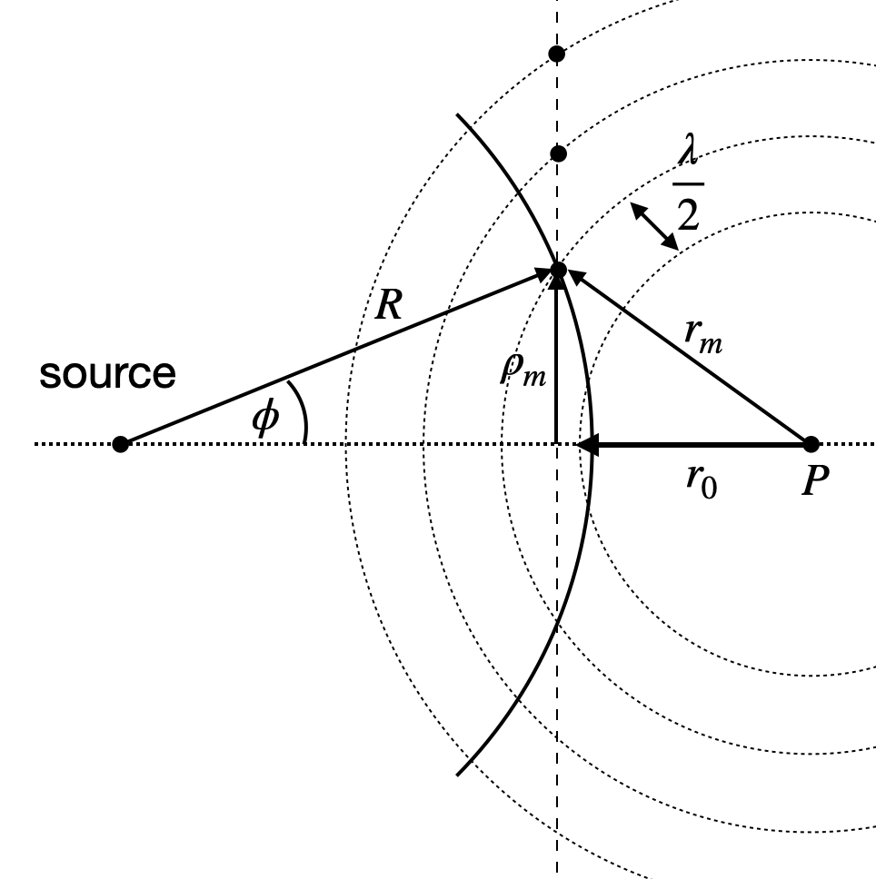
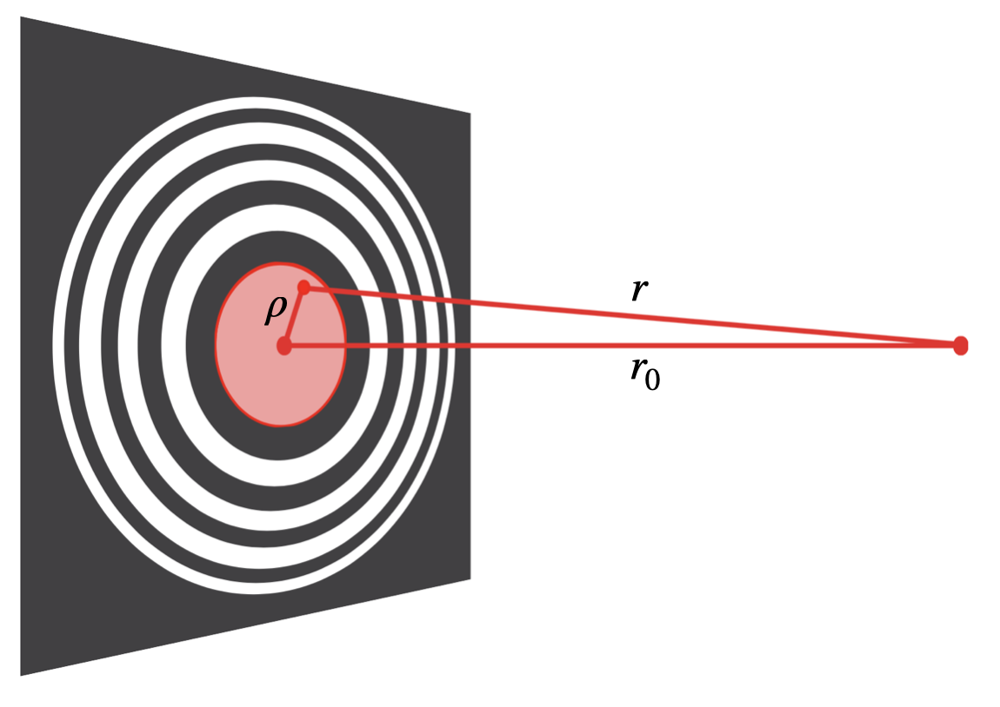
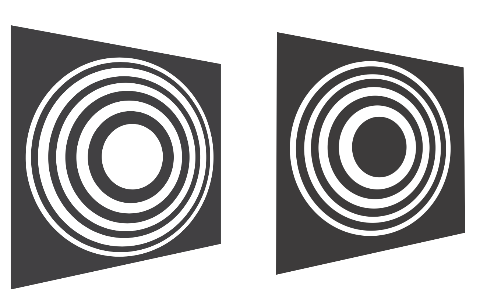
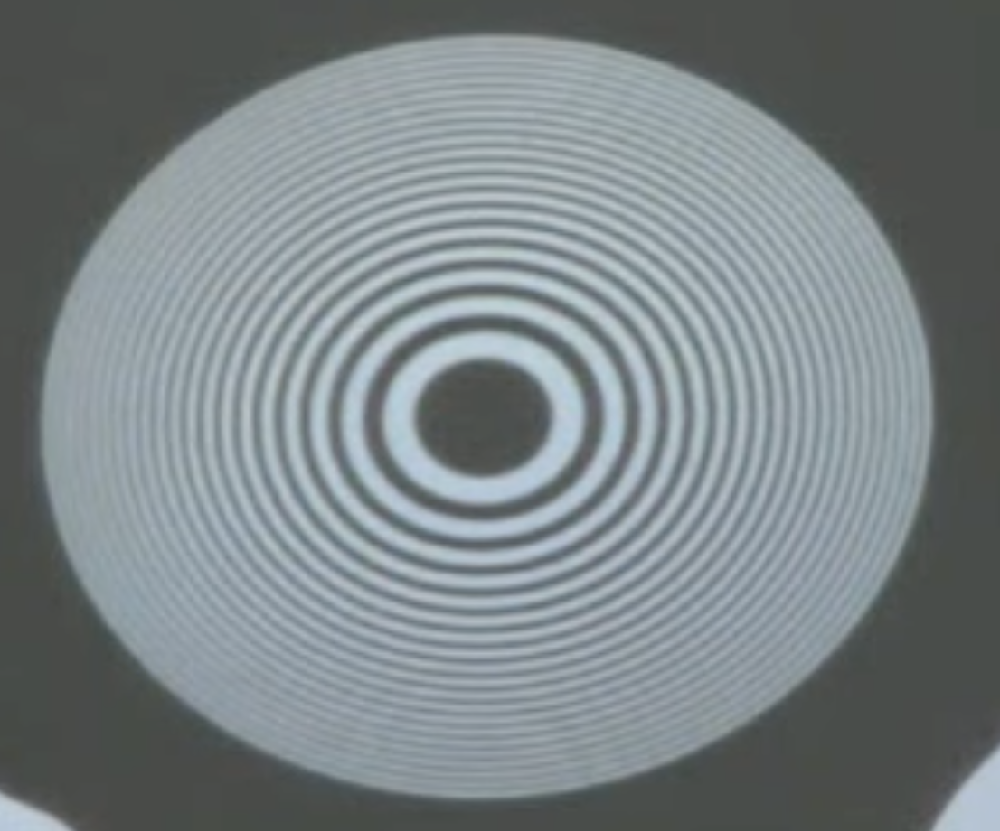
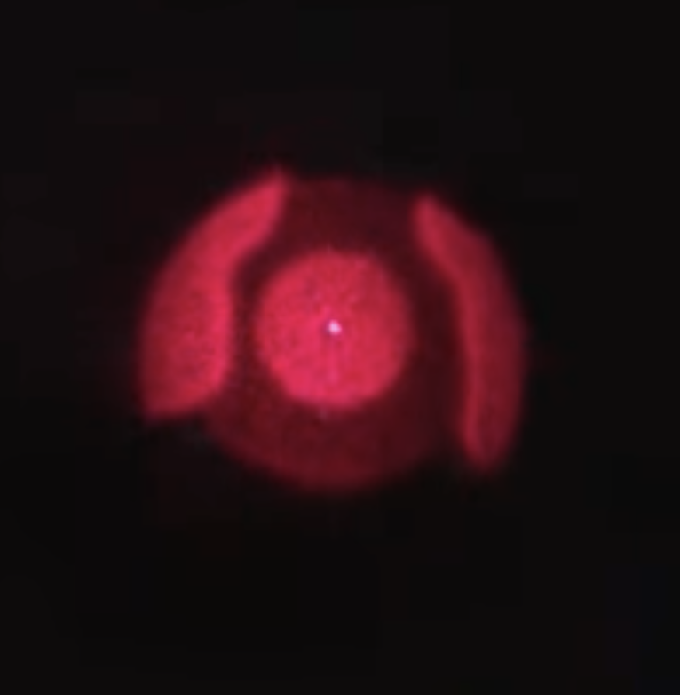
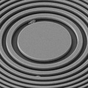

We want to take a more general look at diffraction by exploring a concept known as Fresnel zones. Consider spherical waves of wavelength $\lambda$ emitted from a source, as indicated by the solid line in the sketch below.

{ width=65% }

We will examine the intensity of the wave at a point $P$. To do this, we consider the amplitude contributions from all points on the wavefront, as each point on the wavefront acts as a Huygens source contributing to the intensity at point $P$.

Instead of calculating the intensity explicitly, we will analyze the distances of individual points on the wavefront from point $P$. Specifically, we look at concentric circles around point $P$, where the radius of each circle increases by $\lambda/2$, i.e.,

$$
r_m = r_0 + m \frac{\lambda}{2}
$$

where $m$ is an integer. The regions between $r_m$ and $r_{m+1}$ are called **Fresnel zones**. If we consider two neighboring zones, each zone contains pairs of points that are exactly $\lambda/2$ out of phase. This means that these pairs of points would lead to destructive interference. If we remove these points, we are left with constructive interference along the optical axis only. We can construct such an aperture by calculating the ring radius

$$
\rho_{m}^2 = \left( r_0 + m \frac{\lambda}{2} \right)^2 - r_0^2
$$

according to the sketch above. This yields

$$
\rho_m^2 = r_0 m \lambda + m^2 \frac{\lambda^2}{4}
$$

For $r_{0} \gg \lambda$, we can simplify the above formula to

$$
\rho_m = \sqrt{m r_0 \lambda}
$$

which gives the radius of the individual zones. The width of the zones is given by

$$
\Delta \rho_m = \rho_{m+1} - \rho_m = \sqrt{r_0 \lambda} (\sqrt{m+1} - \sqrt{m})
$$

## Fresnel Zone Plate

If we now fill the ring from $\rho_m$ to $\rho_{m+1}$ on a glass slide but leave the ring from $\rho_{m+1}$ to $\rho_{m+2}$ transparent, we create a so-called **Fresnel zone plate**. Here, the radius in the first zone $r$ ranges from $r_0$ to $r_0 + \lambda/2$. The next zone will range from $r_0 + \lambda/2$ to $r_0 + \lambda$ but is removed from its contribution to the point.

{ width=75% }

The Fresnel zone plate can be constructed by defining the inner reference zone in an arbitrary way. One may either block or transmit the direct path from the light source along the optical axis, resulting in either the odd or even zones being transparent.

{ width=90% }

{ width=49% }
{ width=40% }

Such zone plates are important for applications where focusing of radiation is required but the refractive indices are not large enough to create strong enough refraction. This is especially true for X-ray radiation.

{ width=300px }

Below is an calculation of the intensity pattern at the focal distance of a zone plate from many spherical wave sources if the destructively interfering waves are not removed (left) and if they are removed.

::: {.cell execution_count=2}

::: {.cell-output .cell-output-display}
{}
:::
:::

## Applications and Importance of Fresnel Zone Plates

Fresnel zone plates are used in various applications, particularly where traditional lenses are ineffective. Some key applications include:

**X-ray Microscopy**: Fresnel zone plates are used to focus X-rays, which have very short wavelengths and require special techniques for focusing. Traditional lenses are not effective for X-rays due to their low refractive indices.

**Optical Systems**: In optical systems, Fresnel zone plates can be used to create focal points without the need for bulky lenses. This is particularly useful in compact optical devices.

**Holography**: Fresnel zone plates are used in holography to create and reconstruct holograms. They help in manipulating the wavefronts to produce the desired holographic images.

**Astronomy**: In astronomy, Fresnel zone plates can be used in telescopes to focus light from distant stars and galaxies. They offer an alternative to traditional lenses and mirrors.

