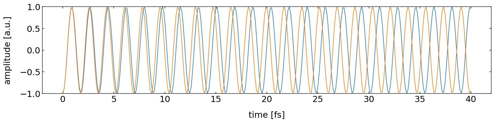

Interference is a fundamental physical phenomenon that demonstrates the superposition principle for linear systems. This principle, which states that the net response to multiple stimuli is the sum of the individual responses, is central to our understanding of wave physics. Interference appears across many domains of physics: in optics where it enables high-precision measurements and holography, in quantum mechanics where it reveals the wave nature of matter, and in acoustics where it forms the basis for noise cancellation technology. The ability of waves to interfere constructively (amplifying each other) or destructively (canceling each other) has profound practical applications, from the anti-reflective coatings on optical elements to the operational principles of interferometric gravitational wave detectors like LIGO. Understanding interference is therefore not just of theoretical interest but crucial for modern technology and experimental physics.

When two wave solutions $U_1(\mathbf{r})$ and $U_2(\mathbf{r})$ combine, their superposition gives:

$$
U(\mathbf{r})=U_1(\mathbf{r})+U_2(\mathbf{r})
$$

The resulting intensity is:

\begin{eqnarray}
I &= &|U|^2\\
&= &|U_1+U_2|^2\\
&= &|U_1|^2+|U_2|^2+U^{*}_1 U_2 + U_1 U^{*}_2
\end{eqnarray}

The individual wave intensities are given by $I_1=|U_1|^2$ and $I_2=|U_2|^2$. Using this, we can express each complex wave amplitude in polar form, separating its magnitude (related to intensity) and phase:

$$
U_1=\sqrt{I_1}e^{i\phi_1}
$$
$$
U_2=\sqrt{I_2}e^{i\phi_2}
$$

Substituting these expressions back into our interference equation and performing the algebra, the total intensity becomes:

$$
I=I_1+I_2+2\sqrt{I_1 I_2}\cos(\Delta \phi)
$$

where $\Delta \phi=\phi_2-\phi_1$ is the phase difference between the waves. This equation is known as the interference formula and contains three terms:

- $I_1$ and $I_2$: the individual intensities
- $2\sqrt{I_1 I_2}\cos(\Delta \phi)$: the interference term that can be positive or negative

A particularly important special case occurs when the interfering waves have equal intensities ($I_1=I_2=I_0$). The equation then simplifies to:

$$
I=2I_0(1+\cos(\Delta \phi))=4I_0\cos^2\left(\frac{\Delta \phi}{2}\right)
$$

This last form clearly shows that:

- Maximum intensity ($4I_0$) occurs when $\Delta \phi = 2\pi n$ (constructive interference)
- Zero intensity occurs when $\Delta \phi = (2n+1)\pi$ (destructive interference)
- The intensity varies sinusoidally with the phase difference

::: {.callout-note}
### Constructive Interference
Occurs when $\Delta \phi=2\pi m$ (where $m$ is an integer), resulting in $I=4I_0$
:::

::: {.cell execution_count=2}

::: {.cell-output .cell-output-display}
{fig-align='center'}
:::
:::

::: {.callout-note}
### Destructive Interference
Occurs when $\Delta \phi=(2m-1)\pi$ (where $m$ is an integer), resulting in $I=0$
:::

::: {.cell execution_count=3}

::: {.cell-output .cell-output-display}
{fig-align='center'}
:::
:::

### Phase and Path Difference

The phase difference $\Delta \phi$ can be related to the path difference $\Delta s$ between the two waves. For two waves with the same frequency $\omega$, we can write their complete phase expressions as:

$$\phi_1(\mathbf{r},t) = \mathbf{k}_1\cdot\mathbf{r} - \omega t + \phi_{01}$$
$$\phi_2(\mathbf{r},t) = \mathbf{k}_2\cdot\mathbf{r} - \omega t + \phi_{02}$$

where:

- $\mathbf{k}_i$ are the wave vectors
- $\mathbf{r}$ is the position vector
- $\omega$ is the angular frequency
- $\phi_{0i}$ are initial phase constants

The instantaneous phase difference is then:

$$
\Delta\phi(\mathbf{r},t) = \phi_2(\mathbf{r},t) - \phi_1(\mathbf{r},t) = (\mathbf{k}_2-\mathbf{k}_1)\cdot\mathbf{r} + (\phi_{02}-\phi_{01})
$$

For stationary interference patterns, we typically observe the time-independent phase difference. When the waves travel along similar paths (same direction), this reduces to:

$$\Delta\phi = k\Delta s + \Delta\phi_0$$

where $\Delta s$ is the path difference and $\Delta\phi_0$ is any initial phase difference between the sources.

::: {.callout-important}
### Phase Difference and Path Difference
A path difference $\Delta s$ corresponds to a phase difference $k\Delta s=2\pi\Delta s/\lambda$. Path differences of integer multiples of $\lambda$ result in phase differences of integer multiples of $2\pi$.

**Important:** The path difference $\Delta s$ represents the **optical path difference**, not just the geometric distance. When light travels through a medium with refractive index $n$ over a physical distance $L$, the optical path length is $\text{OPL} = n \cdot L$. This distinction becomes crucial when analyzing interferometers where light travels through different media or when measuring refractive index changes.
:::

The principles of interference we've developed—relating phase differences to path differences and understanding constructive and destructive interference—form the foundation for a powerful class of precision instruments called interferometers. These devices split light into multiple paths, allow these paths to accumulate different optical path lengths through either geometric differences or variations in refractive index, and then recombine the beams to observe interference. By carefully analyzing the resulting interference patterns, interferometers can measure distances with sub-wavelength precision, detect tiny changes in refractive index, and even sense gravitational waves. We will explore these remarkable applications in detail in a subsequent lecture on interferometers.

### Interference of Waves in Space

::: {.cell execution_count=4}

::: {.cell-output .cell-output-display}
{fig-align='center'}
:::
:::

::: {.cell execution_count=5}

::: {.cell-output .cell-output-display}
{fig-align='center'}
:::
:::

The interference of the spherical and the plane wave (also the one of the two plane waves) give also an interesting result. The intensity resembles to be a snapshot of the shape of the wavefronts of the spherical wave. We can therefore measure the wavefronts of the spherical wave by interfering it with a plane wave. This is also the basic principle behind holography. There we use a reference wave to interfere with the wave that we want to measure. The interference pattern is recorded and can be used to reconstruct the wavefronts of the wave.

::: {.callout-alert}
A super nice website to try out interference interactively is [here](https://www.falstad.com/ripple/).
:::

### Coherence

In the earlier consideration we obtained a general description for the phase difference between two waves. It is given by and contains the optical path difference $\Delta s$ and some intrinsic phase $\Delta\phi_0$ that could be part of the wave generation process.

$$\Delta\phi = k\Delta s + \Delta\phi_0$$

To observe stationary interference, it is important that these two quantities are also stationary, i.e. the phase relation between the two waves is stationary. This relation between the phase of two waves is called coherence and was assumed in all the examples before. Coherence is particularly critical for interferometric applications: devices like the Michelson interferometer, Fabry-Perot cavities, and other precision instruments rely on highly coherent light sources (typically lasers) to maintain stable interference patterns over the path length differences involved in the measurements.

{width="90%" fig-align="center"}

The above image shows the timetrace of the amplitude of two wave with slightly different frequency. Due to the frequency, the waves run out of phase and have acquired a phase different of $\pi$ after $40$ fs.

The temporal coherence of two waves is now defined by the time it takes for the two waves to obtain a phase difference of $2\pi$. The phase difference between two wave of frequency $\nu_1$ and $\nu_2$ is given by

$$
\Delta \phi = 2\pi (\nu_2-\nu_1)(t-t_0)
$$

Here $t_0$ refers to the time, when thw two waves were perfectly in sync. Lets assume that the two frequencies are seperarated from a central frequency $\nu_0$ such that

$$
\nu_1=\nu_0-\Delta \nu/2
$$
$$
\nu_2=\nu_0+\Delta \nu/2
$$

Inserting this into the first equation yields

$$
\Delta \phi = 2\pi \Delta \nu \Delta t
$$

with $\Delta t=t-t_0$. We can now define the coherence time as the time interval over which the phase shift $\Delta \phi$ grows to $2\pi$, i.e. $\Delta \phi=2\pi$. The coherence time is thus

$$
\tau_{c}=\Delta t =\frac{1}{\Delta \nu}
$$

Thus the temporal coherence and the frequency distribution of the light are intrisincly connected. Monochromatic light has $\Delta nu=0$ and thus the coherence time is infinitely long. Light with a wide spectrum (white light for example) therefore has and extremly short coherence time.

The coherence time is also connected to a coherence length. The coherence length $L_c$ is given by the distance light travels within the coherence time $\tau_c$, i.e.

$$
L_c=c\tau_c
$$

::: {.callout-note }
# Coherence

Two waves are called coherent, if they exihibit a fixed phase relation in space or time relation over time. It measures their ability to interfer. The main types of coherence are

### Temporal Coherence
- Measures phase correlation of a wave with itself at different times
- Characterized by coherence time $\tau_c$ and coherence length $L_c = c\tau_c$
- Related to spectral width: $\tau_c = 1/\Delta\nu$
- Perfect for monochromatic waves (single frequency)
- Limited for broad spectrum sources (like thermal light)

### Spatial Coherence
- Measures phase correlation between different points in space
- Important for interference from extended sources
- Determines ability to form interference patterns
- Related to source size and geometry

Coherence is a property of the light source and is connected to the frequency distribution of the light.
Sources can be:

- **Fully coherent**: ideal laser
- **Partially coherent**: real laser
- **Incoherent**: thermal light
:::

### More General Description of Coherence

While the above definition provides an intuitive picture based on frequency spread, we can describe coherence more rigorously using correlation functions. These functions measure how well a wave maintains its phase relationships:

In real physical systems, perfect coherence (constant phase relationship) between waves is rare. Partial coherence describes the degree to which waves maintain a consistent phase relationship over time and space. We can characterize this using correlation functions:

1. **Temporal Coherence**
The complex degree of temporal coherence is given by:

$$g^{(1)}(\tau) = \frac{\langle U(t)U^*(t+\tau)\rangle}{\sqrt{\langle|U(t)|^2\rangle\langle|U(t+\tau)|^2\rangle}}$$

where:

- $\tau$ is the time delay
- $U(t)$ is the electric field
- $\langle...\rangle$ denotes time averaging

2. **Spatial Coherence**
Similarly, spatial coherence between two points is characterized by:

$$g^{(1)}(\mathbf{r}_1,\mathbf{r}_2) = \frac{\langle U(\mathbf{r}_1)U^*(\mathbf{r}_2)\rangle}{\sqrt{\langle|U(\mathbf{r}_1)|^2\rangle\langle|U(\mathbf{r}_2)|^2\rangle}}$$

The obtained correlation functions can be used to calculate the coherence time and length and have the following properties:

- $|g^{(1)}| = 1$ indicates perfect coherence
- $|g^{(1)}| = 0$ indicates complete incoherence
- $0 < |g^{(1)}| < 1$ indicates partial coherence

A finite coherence time and length is leads to partial coherence affects interference visibility through:

- Reduced contrast in interference patterns
- Limited coherence length/area
- Spectral broadening

::: {.cell execution_count=6}

::: {.cell-output .cell-output-display}
{fig-align='center'}
:::
:::

Besides different frequencies the coherence time can also be affected by phase jumps. The following example shows two waves with the same frequency but multiple phase jumps. The temporal correlation function shows the decoherence due to the phase jumps.

::: {.cell execution_count=7}

::: {.cell-output .cell-output-display}
{fig-align='center'}
:::
:::

::: {.callout-note collapse=true}
## Coherence of Thermal radiation

Thermal radiation is a common example of incoherent light. While it is called incoherent, there is no complete incoherence, but the coherence length of a few 10 micrometers. Sun light, for example, has been [measured](https://www.semanticscholar.org/paper/Spatial-coherence-of-sunlight-and-its-implications-Divitt-Novotn%C3%BD/fbc2560b8fc54a10cb0feeac94eb3607e4e80ffb) to have a coherence length of about 50 micrometers (Shawn Divitt and Lukas Novotny, "Spatial coherence of sunlight and its implications for light management in photovoltaics," Optica 2, 95-103 (2015)). The following factors contribute to the incoherence of thermal radiation:

**Random Emission Process**
- Individual atoms/molecules emit light independently
- Each emission event has a random phase
- The emission timing is random
- These random events effectively create continuous phase jumps

**Multiple Emitters**
- Many atoms/molecules emit simultaneously
- Each emitter acts independently
- There's no phase relationship between different emitters
- This leads to spatially incoherent radiation

**Thermal Motion**
- Atoms/molecules are in constant thermal motion
- This motion causes Doppler shifts
- The shifts result in frequency variations
- Motion also affects the phase of emitted radiation

**Collision Effects**
- Frequent atomic/molecular collisions
- Each collision can cause phase jumps
- At higher temperatures, more frequent collisions
- This leads to shorter coherence times
:::

::: {.callout-note collapse=true}
## Partial Coherence in Lasers

The coherence of laser light is limited by various physical mechanisms that cause fluctuations in phase and frequency. While perfect coherence is theoretically impossible, some lasers can achieve remarkable coherence lengths. Single-frequency solid-state lasers, when properly stabilized, are particularly noteworthy in this regard. For instance, a laser with a Lorentzian spectrum of 10 kHz linewidth can achieve a coherence length of 9.5 km.

The fundamental limit to laser coherence is set by quantum noise, as described by the Schawlow-Townes linewidth. However, modern laser systems, particularly those developed for optical clocks, have pushed these boundaries further. Some of these systems have been stabilized to achieve linewidths below one hertz, corresponding to coherence lengths exceeding 300,000 km.

**Spontaneous Emission**
- Not all emission in a laser is stimulated
- Some spontaneous emission is always present
- Adds random phase jumps to the laser field
- Sets fundamental quantum limit to coherence

**Technical Noise Sources**
- Mechanical vibrations of cavity mirrors
- Thermal fluctuations in gain medium
- Pump power fluctuations
- Current noise in diode lasers

**Gain Medium Properties**
- Finite linewidth of the lasing transition
- Thermal motion of atoms/molecules
- Pressure broadening in gas lasers
- Population fluctuations

**Cavity Effects**
- Finite cavity lifetime
- Multiple longitudinal modes
- Temperature-induced length changes

:::

