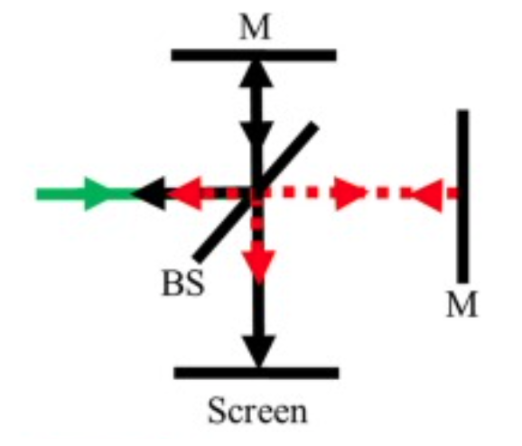
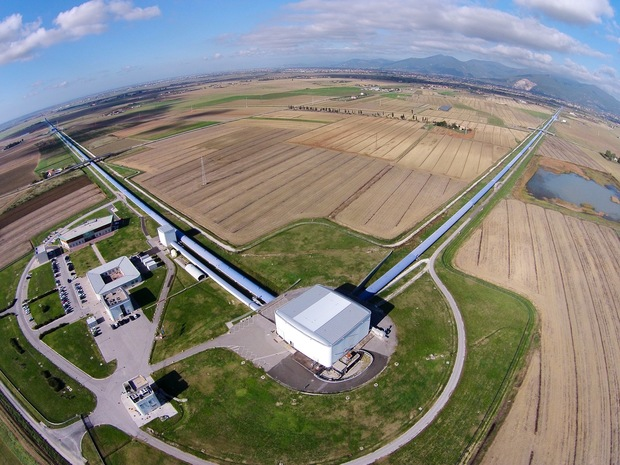
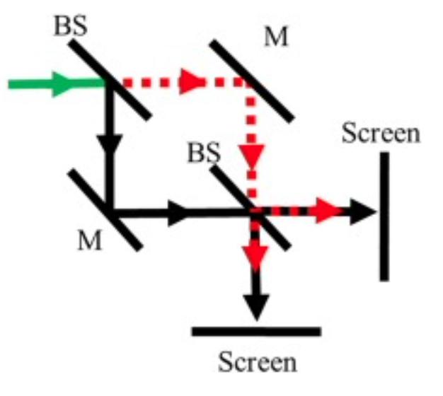
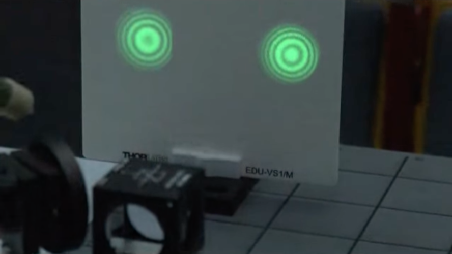
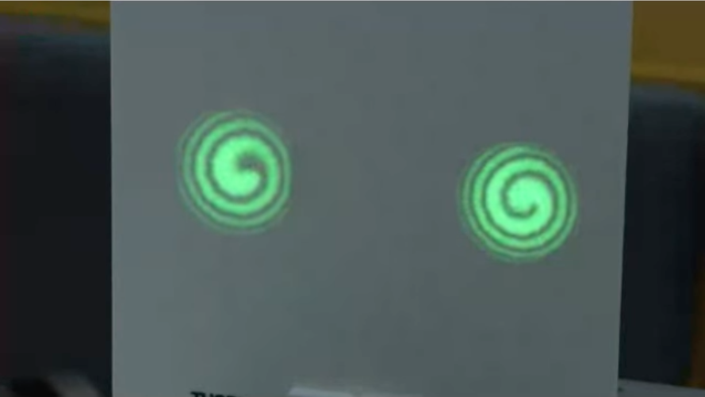
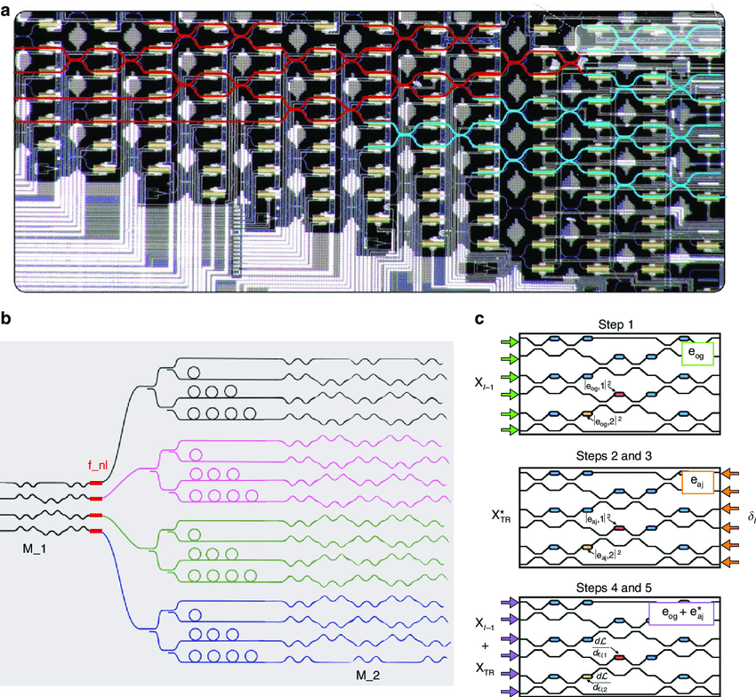
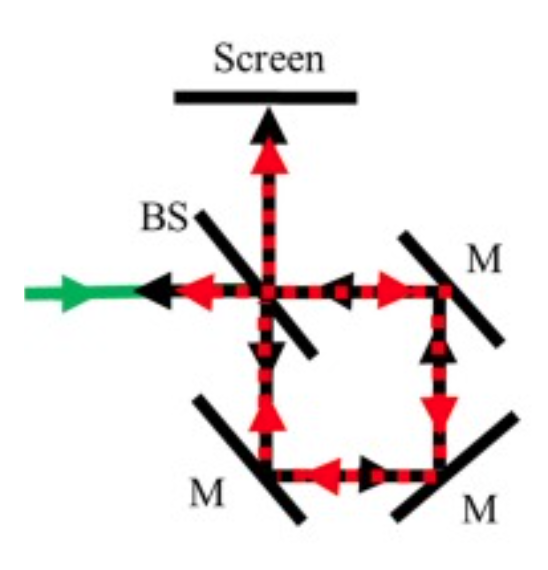

## Introduction: Phase and Optical Path Length

Interferometry is fundamentally based on the principle that light waves accumulate phase as they propagate through space. The key to understanding how interferometers work lies in recognizing the relationship between the optical path length traveled by light and the phase it accumulates along that path. When a light wave travels through a medium with refractive index $n$ over a physical distance $L$, it accumulates an optical path length (OPL) given by $\text{OPL} = n \cdot L$. The phase acquired by the light wave is then directly proportional to this optical path length, expressed as $\phi = \frac{2\pi}{\lambda} \text{OPL}$, where $\lambda$ is the wavelength of light in vacuum.

This relationship has profound implications for interferometric measurements. When we split a beam of light into two paths and then recombine them, the resulting interference pattern depends on the phase difference between the two beams.

::: {.callout-important}
## Fundamental Phase Difference Formula
$$\Delta \phi = \frac{2\pi}{\lambda}(n_1 L_1 - n_2 L_2)$$

This is the cornerstone equation of interferometry. The phase difference $\Delta \phi$ between two light beams depends on the difference in their optical path lengths. Here, $\lambda$ is the wavelength of light, $n_1$ and $n_2$ are the refractive indices along each path, and $L_1$ and $L_2$ are the physical path lengths. This formula reveals two fundamental ways to create a phase difference:

1. **Change the physical path length** ($L$) - used in LIGO, precision metrology
2. **Change the refractive index** ($n$) - used in gas sensing, electro-optic modulators
:::

From this expression, we can immediately see that there are two distinct ways to introduce a phase difference: we can either change the physical length of one path (varying $L$), or we can change the refractive index along one path (varying $n$). This duality is what makes interferometers incredibly versatile instruments, capable of measuring not only distances and mechanical vibrations but also changes in the optical properties of materials, gas composition, temperature, and even rotation.

The interference that results from this phase difference manifests as alternating bright and dark fringes.

::: {.callout-tip}
## Interference Conditions
**Constructive interference (bright fringes):** $\Delta \phi = 2\pi m$ where $m = 0, 1, 2, 3, ...$

**Destructive interference (dark fringes):** $\Delta \phi = \pi(2m + 1)$ where $m = 0, 1, 2, 3, ...$

These conditions determine when light waves add constructively (maximum intensity) or destructively (minimum intensity).
:::

By carefully observing how these interference patterns change, we can extract extremely precise measurements of whatever physical quantity is causing the phase shift. In the following sections, we will explore several important types of interferometers and examine how they exploit these principles for various scientific and technological applications.

## Michelson Interferometer

The Michelson interferometer is perhaps the most fundamental and historically significant optical interferometer. Its basic design elegantly demonstrates the core principles of interferometry while providing a platform for extraordinarily precise measurements. The interferometer consists of a coherent light source, typically a laser, that emits a beam directed toward a beam splitter positioned at 45 degrees to the incoming beam. This beam splitter divides the incident light into two beams of approximately equal intensity: one beam is reflected at 90 degrees toward a fixed mirror, while the other is transmitted straight through toward a movable mirror. After reflecting off their respective mirrors, both beams return to the beam splitter where they are recombined, with portions of each beam directed toward a detector or viewing screen where they interfere.

{width=30%}

The key to understanding the Michelson interferometer lies in analyzing the optical path difference between the two arms. If we denote the distance from the beam splitter to the fixed mirror as $L_1$ and the distance to the movable mirror as $L_2$, then the total optical path difference is $\Delta L = 2(L_2 - L_1)$, where the factor of 2 accounts for the round trip each beam makes to its respective mirror and back. This path difference translates directly into a phase difference of $\Delta \phi = \frac{4\pi(L_2 - L_1)}{\lambda}$. When $L_1 = L_2$, the beams interfere constructively. As we move the movable mirror by a distance $d$, we introduce a path difference of $2d$, and each time this path difference changes by one wavelength, we observe one complete cycle of the interference pattern—from bright to dark and back to bright again.

### Application: Measuring Refractive Index of Gases

One of the most elegant applications of the Michelson interferometer is the measurement of the refractive index of gases. This technique demonstrates beautifully how interferometers can detect not just changes in geometric path length, but also changes in optical path length due to variations in the refractive index. To perform this measurement, we place a transparent gas cell of known length $L$ in one arm of the interferometer. Initially, when the cell is evacuated and contains only vacuum, the optical path through that arm is simply $n_{\text{vacuum}} \cdot L = L$ (since $n_{\text{vacuum}} = 1$). When we introduce a gas into the cell, the refractive index changes from 1 to $n_{\text{gas}}$, which slightly increases the optical path length in that arm to $n_{\text{gas}} \cdot L$.

The change in optical path length is $\Delta(\text{OPL}) = (n_{\text{gas}} - 1)L$. Since the light makes a round trip through the cell, the total change in optical path length is $2(n_{\text{gas}} - 1)L$. This change manifests as a shift in the interference pattern.

::: {.callout-important}
## Gas Refractive Index Measurement Formula
$$n_{\text{gas}} = 1 + \frac{m\lambda}{2L}$$

This formula allows us to determine the refractive index of a gas by counting fringe shifts. Here:
- $m$ = number of bright fringes that pass by as the cell is filled
- $\lambda$ = wavelength of light used
- $L$ = length of the gas cell

**How it works:** Place a gas cell of length $L$ in one arm of the interferometer. As you fill it with gas, the refractive index changes from 1 (vacuum) to $n_{\text{gas}}$, causing fringes to shift. Count the fringes to determine $n_{\text{gas}}$.
:::

Specifically, if we count the number of bright fringes $m$ that pass by a reference point as we fill the cell with gas, we can relate this to the refractive index through the equation $m = \frac{2(n_{\text{gas}} - 1)L}{\lambda}$, which can be rearranged to give the formula above.

For example, if we use a HeNe laser with $\lambda = 632.8$ nm and a gas cell of length $L = 10$ cm, and we observe 20 fringes passing as we fill the cell with air at standard conditions, we can calculate that the refractive index of air is approximately $n_{\text{air}} \approx 1.000063$. This technique is remarkably sensitive; even tiny changes in gas pressure, temperature, or composition can be detected by monitoring the interference pattern. This makes the Michelson interferometer valuable for applications ranging from gas sensing and environmental monitoring to quality control in industrial processes.

### Application: The LIGO Gravitational Wave Detector

The extraordinary sensitivity of the Michelson interferometer to changes in path length reaches its ultimate expression in the Laser Interferometer Gravitational-Wave Observatory, or LIGO. This instrument represents one of the most ambitious and technically challenging scientific instruments ever constructed, designed to detect gravitational waves—ripples in the fabric of spacetime itself predicted by Einstein's general theory of relativity. These waves are generated by some of the most violent events in the universe, such as the collision and merger of black holes or neutron stars, and they propagate through space at the speed of light, stretching and compressing spacetime as they pass.

{with=50%}

LIGO consists of two large Michelson interferometers located at separate sites in the United States: one in Hanford, Washington, and the other in Livingston, Louisiana. Each interferometer has two perpendicular arms extending 4 kilometers in length. A powerful laser beam is split and sent down these arms, where it bounces back and forth many times in Fabry-Pérot cavities before returning to the beam splitter. Under normal conditions, the interferometer is carefully tuned so that the two beams interfere destructively when they recombine, meaning essentially no light reaches the photodetector—this is called the "dark fringe" operating point.

When a gravitational wave passes through the detector, it causes one arm to stretch while simultaneously causing the other arm to compress. This differential change in length, though incredibly tiny, alters the optical path difference between the two arms and thus shifts the interference pattern away from the dark fringe. The detector then registers light, and the amount of light and how it varies with time encodes information about the gravitational wave. The sensitivity required is almost incomprehensible: LIGO must detect changes in arm length smaller than $10^{-19}$ meters, which is less than one-thousandth the diameter of a proton. To put this in perspective, this is equivalent to measuring the distance to the nearest star (4 light-years away) to an accuracy smaller than the width of a human hair.

::: {.callout-important}
## LIGO Phase Shift Formula
$$\Delta \phi = \frac{4\pi \Delta L}{\lambda}$$

This formula describes the phase shift caused by a gravitational wave in LIGO. Here:
- $\Delta L$ = change in arm length due to the gravitational wave
- $\lambda$ = wavelength of the laser (1064 nm for LIGO)
- The factor of 4 comes from: 2 (round trip in each arm) × 2 (differential effect between arms)

**Why factor of 4?** When a gravitational wave passes through: one arm increases by $\Delta L$ while the other decreases by $\Delta L$. The light makes a round trip in each arm, so the total optical path difference is $2 \cdot 2\Delta L = 4\Delta L$.
:::

The phase shift $\Delta \phi$ caused by a gravitational wave can be expressed as shown above. To understand this more carefully, consider that when a gravitational wave passes through the interferometer, it causes a time-varying strain in spacetime. If one arm increases in length by $\Delta L$, the other decreases by approximately the same amount. The round-trip optical path difference between the arms becomes $2 \cdot 2\Delta L = 4\Delta L$, leading to the phase shift formula given above.

The extraordinary precision of LIGO's measurements is achieved through a combination of advanced technologies including powerful stabilized lasers, ultra-high vacuum systems, sophisticated vibration isolation, and quantum noise reduction techniques. Since its first detection of gravitational waves in September 2015, LIGO has opened an entirely new window onto the universe, allowing us to observe cosmic events that are completely invisible to conventional telescopes. This remarkable achievement demonstrates how the simple principles of the Michelson interferometer, when pushed to their ultimate limits, can reveal phenomena at the very frontiers of physics.

::: {.callout-note collapse=true}
## LIGO Technical Details

LIGO consists of two large interferometers located in the United States: one in Hanford, Washington, and the other in Livingston, Louisiana. These facilities are operated by the LIGO Scientific Collaboration (LSC), which includes scientists from various institutions around the world. Here is a link to the [LIGO website](https://www.ligo.caltech.edu/) and a direct link to an [overview document](https://www.ligo.caltech.edu/system/media_files/binaries/303/original/ligo-educators-guide.pdf?1455165573).

The interferometer design employs a Michelson interferometer configuration with 4-kilometer-long arms forming an "L" shape. Each arm contains a Fabry-Pérot cavity to increase the effective path length of the laser beams. These cavities are formed by highly reflective mirrors placed at the ends of the arms, and the laser beams bounce back and forth multiple times within the cavities, effectively increasing the arm length to several hundred kilometers. The laser system uses a high-power, stabilized laser operating at a wavelength of 1064 nm in the infrared. The laser power is typically around 200 watts, but the effective power in the interferometer arms is increased to several kilowatts using power recycling techniques.

The mirrors and other optical components are suspended by a system of pendulums to isolate them from ground vibrations and other noise sources. The suspension system includes multiple stages of isolation, including active and passive damping mechanisms. The interferometer arms are housed in ultra-high vacuum tubes to eliminate air molecules that could scatter the laser beams and introduce noise, maintaining a pressure of around $10^{-9}$ torr.

Gravitational waves are detected through their effect on the interference pattern. As a gravitational wave passes through the interferometer, it stretches and compresses the spacetime along the arms, causing tiny changes in the arm lengths. These changes cause a phase shift in the laser beams when they recombine at the beam splitter, resulting in a change in the interference pattern that is detected by photodetectors. LIGO is designed to detect changes in arm lengths as small as $10^{-19}$ meters through advanced noise reduction techniques.

The data from the photodetectors are processed using advanced algorithms and computational techniques to filter out noise and extract potential gravitational wave signals. When a potential event is detected, the data are analyzed to determine the properties of the source, such as the masses and spins of merging black holes or neutron stars. Detection is confirmed by comparing data from both LIGO detectors and, if available, data from other gravitational wave observatories like Virgo in Europe.
:::

## Mach-Zehnder Interferometer

The Mach-Zehnder interferometer represents a different geometric configuration that offers distinct advantages for certain applications, particularly those involving the manipulation and modulation of light in optical systems. Unlike the Michelson interferometer where the two beams travel back and forth along the same paths, the Mach-Zehnder interferometer splits a beam into two separate paths that never retrace themselves, and the beams are recombined at a different location from where they were split. This architecture makes it particularly suitable for applications where you want to place samples or active devices in one or both paths without the complications of retroreflection.

{width=30%}

The interferometer consists of a coherent light source that emits a beam toward a first beam splitter, which divides the light into two beams of approximately equal intensity. These two beams propagate along separate paths, each encountering a mirror that redirects them toward a second beam splitter. At this second beam splitter, the two beams are recombined and directed toward two output ports. The relative phase between the two beams when they arrive at the second beam splitter determines the interference pattern and consequently how much light exits from each output port. If the two paths have exactly the same optical path length, the beams arrive in phase at the second beam splitter, and the interference is purely constructive at one output port and destructive at the other.

::: {.callout-tip}
## Mach-Zehnder Phase Difference
$$\Delta \phi = \frac{2\pi}{\lambda}(n_1 L_1 - n_2 L_2)$$

Unlike the Michelson interferometer, the Mach-Zehnder uses non-retroreflecting paths (no factor of 2 from round trips). The phase difference depends on:

- $L_1, L_2$ = physical path lengths of the two arms
- $n_1, n_2$ = refractive indices along each arm

By controlling either the path length or refractive index in one arm, we can switch light between output ports.
:::

By introducing changes to either the path length or the refractive index in one arm, we can control the phase difference and thereby switch the light between the two output ports. This controllability makes the Mach-Zehnder interferometer ideal for applications in optical communications, sensing, and information processing.

::: {layout-ncol=2}

:::

### Application: Electro-Optic Modulators in Photonic Integrated Circuits

One of the most important modern applications of the Mach-Zehnder interferometer is in electro-optic phase modulators, particularly those implemented on photonic integrated circuits. These devices are essential components in fiber-optic communication systems, optical computing, and various sensing applications. The basic principle involves placing an electro-optic material—a material whose refractive index changes in response to an applied electric field—in one or both arms of the interferometer. When voltage is applied to electrodes positioned near the waveguides, the resulting electric field modulates the refractive index of the material through the Pockels effect, thereby changing the optical path length in that arm and introducing a phase shift.

In a typical integrated Mach-Zehnder modulator fabricated on a lithium niobate substrate or silicon photonic platform, light enters the device and is split equally into two waveguide arms. Electrodes are patterned along one or both arms, and when a voltage $V$ is applied, it creates an electric field that changes the refractive index by an amount proportional to the applied field.

::: {.callout-important}
## Electro-Optic Phase Modulation (Pockels Effect)
**Refractive index change:**
$$\Delta n = -\frac{1}{2}n^3 r E$$

**Resulting phase shift:**
$$\Delta \phi = \frac{2\pi}{\lambda} \Delta n \cdot L$$

where:

- $n$ = unperturbed refractive index
- $r$ = Pockels coefficient (material property)
- $E$ = applied electric field
- $L$ = length of the modulator arm
- $\lambda$ = wavelength of light

**Key principle:** Applying voltage changes the electric field $E$, which changes the refractive index $\Delta n$ via the Pockels effect, which in turn changes the phase $\Delta \phi$. This voltage-controlled phase shift enables high-speed optical modulation for telecommunications and photonic computing.
:::

When the beams recombine at the output, the interference pattern depends on this voltage-controlled phase shift. By varying the applied voltage, we can continuously tune the output intensity from maximum (constructive interference) to minimum (destructive interference) and back again. This allows us to encode electrical signals onto optical carriers, converting the electrical voltage signal into variations in optical intensity—a process essential for transmitting data through optical fibers. The speed at which these modulators can operate is determined by the response time of the electro-optic effect and the electrical bandwidth of the device, with state-of-the-art modulators achieving modulation rates exceeding 100 GHz.

Beyond telecommunications, Mach-Zehnder modulators are now finding applications in emerging photonic computing systems. Arrays of interconnected Mach-Zehnder interferometers can be configured to perform matrix multiplication operations optically, which is a fundamental operation in neural networks and machine learning algorithms. In these systems, the phase shifters in each Mach-Zehnder element are programmed to represent the weights of the neural network, and the optical signals propagating through the network perform the computations at the speed of light with potentially much lower energy consumption than electronic processors.

This image illustrates a sophisticated implementation where multiple Mach-Zehnder interferometers are arranged in a network to create an all-optical neural network processor. Each interferometer acts as a programmable element that can be tuned to implement specific mathematical operations, and the entire network performs complex computations by manipulating the phase and amplitude of light waves as they propagate through the structure. This represents a powerful demonstration of how the simple principle of interference can be scaled up and integrated to create advanced photonic systems with applications in artificial intelligence and high-speed information processing.

## Sagnac Interferometer

The Sagnac interferometer operates on a fundamentally different principle from the Michelson and Mach-Zehnder interferometers we have discussed so far. While those devices are sensitive to differences in path length or refractive index between two spatially separated paths, the Sagnac interferometer is specifically designed to detect rotation. This unique capability has made it the basis for highly accurate fiber-optic gyroscopes used in aircraft navigation, spacecraft attitude control, and autonomous vehicle systems.

{width=30%}

In a Sagnac interferometer, a beam of light is split into two beams that travel around the same closed loop but in opposite directions—one clockwise and the other counterclockwise. These counter-propagating beams are then recombined after completing their journeys around the loop. In a non-rotating reference frame, both beams travel exactly the same path and accumulate the same phase, resulting in perfect constructive interference when they recombine. However, when the entire interferometer is rotating, something remarkable happens: the two beams experience different effective path lengths despite traveling along the same physical path. This is a consequence of the fact that, in the rotating frame of the interferometer, the point where the beams recombine is moving. From the perspective of the laboratory frame, the beam traveling in the direction of rotation has a slightly longer path to travel to reach the recombination point, while the beam traveling opposite to the rotation has a slightly shorter path.

### Derivation and Application in Fiber-Optic Gyroscopes

The phase shift induced by rotation can be derived by considering the time difference between the two counter-propagating beams. For an interferometer loop enclosing an area $A$ and rotating with angular velocity $\Omega$, the time difference $\Delta T$ between the two beams can be shown to be $\Delta T = \frac{4A\Omega}{c^2}$, where $c$ is the speed of light. This time difference directly translates into a phase shift.

::: {.callout-important}
## Sagnac Effect: Rotation-Induced Phase Shift
$$\Delta \phi = \frac{8\pi A \Omega}{\lambda c}$$

This fundamental formula for rotation sensing shows that the phase shift depends on:
- $A$ = area enclosed by the light path
- $\Omega$ = angular velocity of rotation
- $\lambda$ = wavelength of light
- $c$ = speed of light

**Key insight:** The phase shift is independent of the loop shape—only the enclosed area matters! A circular, square, or irregular loop with the same area will have the same sensitivity to rotation.

**Practical implementation:** In fiber-optic gyroscopes, the fiber is coiled $N$ times, giving total area $A = N \cdot A_0$, which multiplies the sensitivity by $N$.
:::

This remarkably simple formula shows that the phase shift is directly proportional to the angular velocity $\Omega$ and to the area $A$ enclosed by the light path, but is independent of the shape of that path. This is a profound result: whether the loop is circular, square, or any other shape, only the enclosed area matters for determining the sensitivity to rotation.

](img/sagnac_exp.png){width=50%}

In practical fiber-optic gyroscopes, the light path is formed by winding many turns of optical fiber into a coil. If the fiber is wound into $N$ turns, each enclosing an area $A_0$, then the total effective area is $A = N \cdot A_0$, which greatly enhances the sensitivity of the device. Modern fiber-optic gyroscopes can use coils with hundreds or even thousands of turns, achieving extraordinary sensitivity to rotation rates. These devices have several advantages over mechanical gyroscopes: they have no moving parts, are immune to mechanical wear, can operate over a wide range of temperatures, and are relatively compact and lightweight.

The sensitivity of a Sagnac gyroscope can be expressed as the minimum detectable rotation rate, which depends on the ability to measure small phase shifts. With modern photodetectors and signal processing techniques, phase shifts as small as microradians can be detected, corresponding to rotation rates of fractions of a degree per hour. This level of performance makes fiber-optic gyroscopes suitable for inertial navigation systems in commercial aircraft, military vehicles, and spacecraft, where they provide continuous information about the vehicle's orientation and angular velocity without requiring any external reference.

::: {.callout-note collapse=true}
### Derivation Details

To derive the formula for the time difference $\Delta T$ between two counter-propagating beams in a Sagnac interferometer, we start by considering a loop of perimeter $L$ and area $A$. The interferometer is rotating with an angular velocity $\Omega$. Light travels in opposite directions around the loop, creating two counter-propagating beams.

In a non-rotating frame, the time taken for light to travel around the loop is $T = \frac{L}{c}$. When the interferometer rotates with angular velocity $\Omega$, the effective path lengths for the two beams differ due to the rotation. For the beam traveling in the direction of rotation, the effective path length increases, while for the beam traveling opposite to the direction of rotation, the effective path length decreases.

The relative velocity of light with respect to the rotating frame is $c \pm v$, where $v = \Omega R$ is the tangential velocity at the perimeter of the loop. For small angular velocities, we can approximate the effect using the area $A$ and the angular velocity $\Omega$.

The time taken for the beam traveling in the direction of rotation is $T_+ = \frac{L}{c - v}$, and the time taken for the beam traveling opposite to the direction of rotation is $T_- = \frac{L}{c + v}$. For small $v$, we can use the binomial expansion to approximate the times:

$$
T_+ \approx \frac{L}{c}\left(1 + \frac{v}{c}\right), \quad T_- \approx \frac{L}{c}\left(1 - \frac{v}{c}\right)
$$

The time difference between the two beams is:

$$
\Delta T = T_+ - T_- = \frac{L}{c}\left(1 + \frac{v}{c}\right) - \frac{L}{c}\left(1 - \frac{v}{c}\right) = \frac{2Lv}{c^2}
$$

The tangential velocity $v$ is related to the angular velocity $\Omega$ and the effective radius $R$ of the loop. For a general loop shape, we can relate the area and perimeter through the geometry of the loop. For a circular loop, $A = \pi R^2$ and $L = 2\pi R$, giving $R = \frac{L}{2\pi}$ and thus $v = \Omega \frac{L}{2\pi}$.

Substituting this into the expression for $\Delta T$:

$$
\Delta T = \frac{2L \cdot \Omega \frac{L}{2\pi}}{c^2} = \frac{L^2 \Omega}{\pi c^2}
$$

For a circular loop, $L^2 = 4\pi A$, which gives:

$$
\Delta T = \frac{4\pi A \Omega}{\pi c^2} = \frac{4A\Omega}{c^2}
$$

This result, remarkably, holds for arbitrary loop shapes, not just circular ones, which can be proven using more general arguments from relativity theory.
:::

## Conclusion

The three types of interferometers we have explored—Michelson, Mach-Zehnder, and Sagnac—illustrate the remarkable versatility of interferometric techniques. All of these devices rely on the fundamental relationship between optical path length and phase, exploiting the fact that light waves accumulate phase as they propagate and that this phase accumulation is sensitive to both the geometric path length and the refractive index of the medium through which the light travels. By carefully designing the geometry and choosing what physical quantities to vary, interferometers can be optimized to measure an extraordinary range of phenomena: from the refractive index of gases and the mechanical vibrations of mirrors to the passage of gravitational waves and the rotation of spacecraft. As technology continues to advance, particularly in photonic integration and quantum-enhanced measurements, interferometers will undoubtedly continue to play a central role in both fundamental scientific research and practical technological applications.
