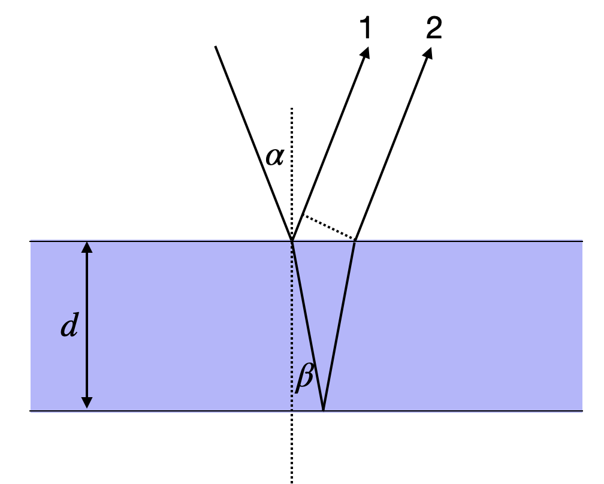
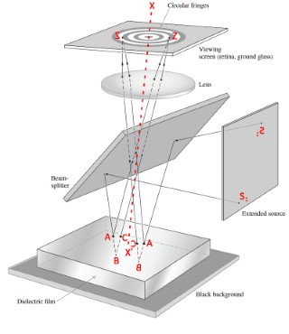
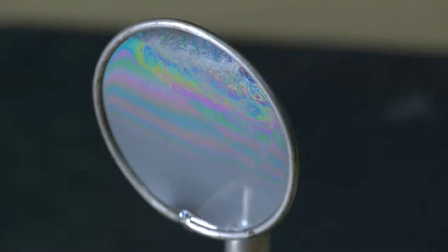
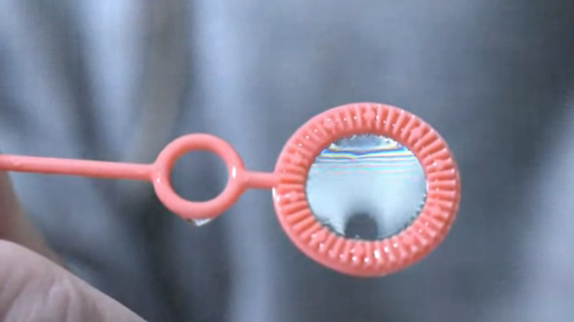
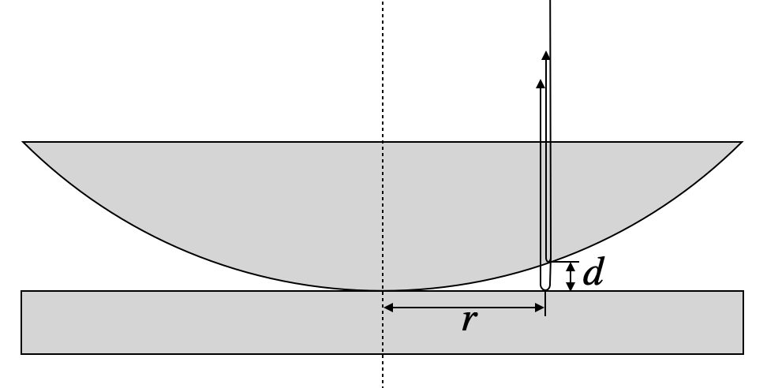
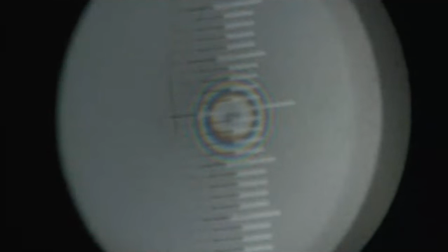

```{python}
#| echo: false

import numpy as np
import matplotlib.pyplot as plt

from time import sleep,time
from ipycanvas import MultiCanvas, hold_canvas,Canvas
import matplotlib as mpl
import matplotlib.cm as cm
from matplotlib.patches import Arc
from matplotlib.transforms import Bbox, IdentityTransform, TransformedBbox


class AngleAnnotation(Arc):
    """
    Draws an arc between two vectors which appears circular in display space.
    """
    def __init__(self, xy, p1, p2, size=75, unit="points", ax=None,
                 text="", textposition="inside", text_kw=None, **kwargs):
        """
        Parameters
        ----------
        xy, p1, p2 : tuple or array of two floats
            Center position and two points. Angle annotation is drawn between
            the two vectors connecting *p1* and *p2* with *xy*, respectively.
            Units are data coordinates.

        size : float
            Diameter of the angle annotation in units specified by *unit*.

        unit : str
            One of the following strings to specify the unit of *size*:

            * "pixels": pixels
            * "points": points, use points instead of pixels to not have a
              dependence on the DPI
            * "axes width", "axes height": relative units of Axes width, height
            * "axes min", "axes max": minimum or maximum of relative Axes
              width, height

        ax : `matplotlib.axes.Axes`
            The Axes to add the angle annotation to.

        text : str
            The text to mark the angle with.

        textposition : {"inside", "outside", "edge"}
            Whether to show the text in- or outside the arc. "edge" can be used
            for custom positions anchored at the arc's edge.

        text_kw : dict
            Dictionary of arguments passed to the Annotation.

        **kwargs
            Further parameters are passed to `matplotlib.patches.Arc`. Use this
            to specify, color, linewidth etc. of the arc.

        """
        self.ax = ax or plt.gca()
        self._xydata = xy  # in data coordinates
        self.vec1 = p1
        self.vec2 = p2
        self.size = size
        self.unit = unit
        self.textposition = textposition

        super().__init__(self._xydata, size, size, angle=0.0,
                         theta1=self.theta1, theta2=self.theta2, **kwargs)

        self.set_transform(IdentityTransform())
        self.ax.add_patch(self)

        self.kw = dict(ha="center", va="center",
                       xycoords=IdentityTransform(),
                       xytext=(0, 0), textcoords="offset points",
                       annotation_clip=True)
        self.kw.update(text_kw or {})
        self.text = ax.annotate(text, xy=self._center, **self.kw)

    def get_size(self):
        factor = 1.
        if self.unit == "points":
            factor = self.ax.figure.dpi / 72.
        elif self.unit[:4] == "axes":
            b = TransformedBbox(Bbox.unit(), self.ax.transAxes)
            dic = {"max": max(b.width, b.height),
                   "min": min(b.width, b.height),
                   "width": b.width, "height": b.height}
            factor = dic[self.unit[5:]]
        return self.size * factor

    def set_size(self, size):
        self.size = size

    def get_center_in_pixels(self):
        """return center in pixels"""
        return self.ax.transData.transform(self._xydata)

    def set_center(self, xy):
        """set center in data coordinates"""
        self._xydata = xy

    def get_theta(self, vec):
        vec_in_pixels = self.ax.transData.transform(vec) - self._center
        return np.rad2deg(np.arctan2(vec_in_pixels[1], vec_in_pixels[0]))

    def get_theta1(self):
        return self.get_theta(self.vec1)

    def get_theta2(self):
        return self.get_theta(self.vec2)

    def set_theta(self, angle):
        pass

    # Redefine attributes of the Arc to always give values in pixel space
    _center = property(get_center_in_pixels, set_center)
    theta1 = property(get_theta1, set_theta)
    theta2 = property(get_theta2, set_theta)
    width = property(get_size, set_size)
    height = property(get_size, set_size)

    # The following two methods are needed to update the text position.
    def draw(self, renderer):
        self.update_text()
        super().draw(renderer)

    def update_text(self):
        c = self._center
        s = self.get_size()
        angle_span = (self.theta2 - self.theta1) % 360
        angle = np.deg2rad(self.theta1 + angle_span / 2)
        r = s / 2
        if self.textposition == "inside":
            r = s / np.interp(angle_span, [60, 90, 135, 180],
                                          [3.3, 3.5, 3.8, 4])
        self.text.xy = c + r * np.array([np.cos(angle), np.sin(angle)])
        if self.textposition == "outside":
            def R90(a, r, w, h):
                if a < np.arctan(h/2/(r+w/2)):
                    return np.sqrt((r+w/2)**2 + (np.tan(a)*(r+w/2))**2)
                else:
                    c = np.sqrt((w/2)**2+(h/2)**2)
                    T = np.arcsin(c * np.cos(np.pi/2 - a + np.arcsin(h/2/c))/r)
                    xy = r * np.array([np.cos(a + T), np.sin(a + T)])
                    xy += np.array([w/2, h/2])
                    return np.sqrt(np.sum(xy**2))

            def R(a, r, w, h):
                aa = (a % (np.pi/4))*((a % (np.pi/2)) <= np.pi/4) + \
                     (np.pi/4 - (a % (np.pi/4)))*((a % (np.pi/2)) >= np.pi/4)
                return R90(aa, r, *[w, h][::int(np.sign(np.cos(2*a)))])

            bbox = self.text.get_window_extent()
            X = R(angle, r, bbox.width, bbox.height)
            trans = self.ax.figure.dpi_scale_trans.inverted()
            offs = trans.transform(((X-s/2), 0))[0] * 72
            self.text.set_position([offs*np.cos(angle), offs*np.sin(angle)])

plt.rcParams.update({'font.size': 10,
                     'lines.linewidth': 1,
                     'lines.markersize': 5,
                     'axes.labelsize': 10,
                     'axes.labelpad':0,
                     'xtick.labelsize' : 9,
                     'ytick.labelsize' : 9,
                     'legend.fontsize' : 8,
                     'contour.linewidth' : 1,
                     'xtick.top' : True,
                     'xtick.direction' : 'in',
                     'ytick.right' : True,
                     'ytick.direction' : 'in',
                     'figure.figsize': (4, 3),
                     'axes.titlesize':8})

def get_size(w,h):
    return((w/2.54,h/2.54))

```


## Introduction: The Physics of Thin Film Interference

When light encounters a thin transparent film—whether it's a soap bubble shimmering in the sunlight, an oil slick on wet pavement, or the specialized coating on your camera lens—something remarkable happens. The light doesn't simply pass through or bounce off. Instead, it splits into multiple beams that reflect from both the front and back surfaces of the film, and these beams then interfere with each other. This interference can either enhance or suppress certain wavelengths, creating the vivid colors we observe in everyday life and enabling crucial technological applications in optics.

The phenomenon of thin film interference occurs whenever light reflects from the two surfaces of a film whose thickness is comparable to the wavelength of light. Understanding this effect requires us to carefully track the optical path difference between light reflected from the front surface and light that travels through the film, reflects from the back surface, and emerges to travel in the same direction. As we'll see, the thickness of the film, the angle at which light strikes it, and the refractive indices of the materials all play crucial roles in determining which colors are enhanced and which are suppressed.

## Basic Principle of Thin Film Interference

The reflection and transmission of waves on a thin film can be regarded as an interference between multiple waves. Consider a light wave incident on a thin film as depicted below. A part of the wave is reflected at the first boundary (beam 1). Another part is transmitted through the first boundary, travels through the film, reflects at the second boundary, and is then transmitted back through the first boundary to travel in the same direction as beam 1 (beam 2). The lines and arrows in the figure denote the direction of the wavevector $\vec{k}$ of these partial waves.

{width=50% fig-align="center"}

This picture of a single reflection at each interface is a simplification. In reality, multiple reflections occur at both interfaces, leading to an infinite number of partial waves. However, for interfaces with weak reflection coefficients—such as the air-glass interface where only about 4% of the light is reflected—the contribution of higher-order reflections becomes negligible. After two reflections, the amplitude is already reduced to approximately 0.16% of the incident wave. Therefore, considering just the first two partial waves provides an excellent approximation for most practical situations involving weak reflections.

For the geometry shown in the figure above, we consider a medium with refractive index $n_1$ (typically air) surrounding a film with refractive index $n_2$. To determine when the reflected waves interfere constructively or destructively, we must calculate the path difference $\Delta s$ between waves 1 and 2. This path difference consists of two contributions: the optical path that wave 2 travels inside the film, and the additional geometric path that wave 1 travels after its reflection. For light incident at angle $\alpha$ to the normal, and refracted to angle $\beta$ inside the film according to Snell's law, the path difference can be expressed as:

$$
\Delta s=\frac{2n_2d}{\cos(\beta)}-2d\tan(\beta)\sin(\alpha)
$$

where $d$ is the thickness of the film. The first term represents the optical path inside the film traveled by wave 2, while the second term accounts for the additional geometric path of wave 1 after reflection (shown by the dotted line in the figure).

Using Snell's law, $n_1\sin(\alpha) = n_2\sin(\beta)$, and setting $n_1 = 1$ (air) and $n_2 = n$ (film), we can apply some trigonometric identities to simplify this expression considerably:

$$
\Delta s =\frac{2nd}{\cos(\beta)}-\frac{2nd\sin^2(\beta)}{\cos(\beta)}=2n d \cos(\beta)=2d\sqrt{n^2-\sin^2(\alpha)}
$$

However, the optical path difference alone doesn't tell the complete story. We must also account for phase changes that occur upon reflection at the boundaries. The total phase difference $\Delta \phi$ between the waves includes both the path difference and these interface effects:

::: {.callout-important}
## General Phase Difference Formula for Thin Films
$$\Delta \phi=\frac{2\pi}{\lambda}\Delta s +\pi$$

where:

- $\Delta s = 2d\sqrt{n^2-\sin^2(\alpha)}$ is the optical path difference
- $\lambda$ is the wavelength of light in vacuum
- $d$ is the film thickness
- $n$ is the refractive index of the film
- $\alpha$ is the incident angle
- The additional $\pi$ term represents the phase jump at the first interface (when $n_1 < n_2$)

**Key insight:** The phase jump of $\pi$ occurs whenever light reflects from an optically denser medium (higher refractive index). No phase jump occurs when reflecting from a less dense medium.
:::

The additional $\pi$ term in the phase difference is crucial and arises from the reflection at the first interface where $n_1 < n_2$. This phase jump of $\pi$ radians (or half a wavelength in optical path) occurs whenever light reflects from an optically denser medium. No such phase jump occurs at the second interface where light in the film ($n_2$) reflects from the surrounding medium ($n_1 < n_2$).


::: {.callout-note}
## Phase Jump at Boundaries

Waves may experience phase jumps upon reflection, depending on the relative refractive indices of the two media. A light wave will experience a phase jump of $\pi$ when reflecting from a medium of higher refractive index. Conversely, no phase jump occurs when light reflects from a medium of lower refractive index. This phenomenon is analogous to a wave on a string: when the string is attached to a rigid wall (like going from a less dense to a more dense medium), the reflected wave is inverted. When the string end is free (like going from a denser to a less dense medium), the reflected wave is not inverted. The detailed physical reasons will be covered when we examine the *Fresnel formulas in electromagnetic optics*.
:::


## Normal Incidence: Simplifying the Analysis

To develop intuition for thin film interference, let's consider the simpler case of normal incidence where $\alpha=0$. In this configuration, light strikes the film perpendicular to its surface, eliminating the angular dependence and simplifying the path difference to $\Delta s = 2nd$. The phase difference then becomes:

::: {.callout-tip}
## Phase Difference at Normal Incidence
$$\Delta \phi=\frac{2\pi}{\lambda}2dn+\pi = \frac{4\pi nd}{\lambda}+\pi$$

This simplified formula applies when light hits the film perpendicular to its surface ($\alpha = 0$).

**For constructive interference:** $\Delta \phi = 2\pi m$ where $m = 1, 2, 3, ...$

**For destructive interference:** $\Delta \phi = \pi(2m-1)$ where $m = 1, 2, 3, ...$
:::

When searching for constructive interference, the phase shift should correspond to an integer multiple of $2\pi$, that is, $\Delta \phi = 2\pi m$ where $m$ is a positive integer. An interesting observation emerges from this equation: for a film thickness of $d = 0$, we would have a residual phase shift of $\pi$, meaning destructive interference. While a zero-thickness film is not physically meaningful, this tells us that very thin films will tend to suppress reflection rather than enhance it—a fact we'll explore further when discussing Newton black films.

There are two complementary ways to analyze thin film interference, each useful for different applications. We can either determine what film thickness produces constructive interference for a given wavelength (useful for designing optical coatings), or we can determine which wavelengths interfere constructively for a given film thickness (useful for understanding colored patterns in soap films and oil slicks). Let's explore both approaches through concrete examples.

### Fixed Wavelength: Designing Optical Coatings

When we fix the wavelength $\lambda$ and solve for the film thickness that produces constructive interference, we obtain:

::: {.callout-important}
## Thickness for Constructive Interference
$$d=\frac{(2m-1)\lambda}{4n}$$

where $m = 1, 2, 3, ...$ is the order of interference.

**Minimum thickness for constructive interference:** Setting $m = 1$ gives $d = \frac{\lambda}{4n}$, known as a quarter-wave film.

**Application:** This formula is fundamental for designing anti-reflection coatings, dichroic mirrors, and optical filters. By choosing the appropriate thickness, we can selectively enhance or suppress specific wavelengths.
:::

This relationship tells us that constructive interference occurs at discrete thicknesses separated by $\lambda/(2n)$. The thinnest film showing constructive interference has thickness $d = \lambda/(4n)$, called a quarter-wave film. This principle is exploited in anti-reflection coatings on eyeglasses, camera lenses, and solar panels, where a carefully chosen film thickness minimizes reflections at a target wavelength (typically green light at 550 nm, where human eyes are most sensitive).

When we observe thin films of varying thickness, such as a soap film stretched across a wire frame, regions of the same thickness appear as colored fringes. These interference fringes correspond to iso-thickness lines, providing a visual map of the film's thickness variation. This property makes thin film interference useful for precision measurements in optical metrology and quality control.

### Fixed Thickness: Understanding Colored Films

Now let's consider the complementary situation: a film of fixed thickness $d$ illuminated by white light containing a mixture of wavelengths. In this case, only certain wavelengths will satisfy the condition for constructive interference:

::: {.callout-important}
## Wavelengths Showing Constructive Interference
$$\lambda_{max}=\frac{4nd}{2m-1}$$

where $m = 1, 2, 3, ...$ determines which wavelengths are enhanced.

**Key insight:** For a given thickness $d$, only discrete wavelengths satisfy constructive interference. The longest wavelength (corresponding to $m = 1$) dominates the color we perceive.

**Why thin films appear colored:** When white light illuminates a thin film, only specific wavelengths are strongly reflected, while others are suppressed by destructive interference. This wavelength selectivity creates the vivid colors in soap bubbles, oil slicks, and butterfly wings.
:::

This equation explains why thin films appear colored when illuminated by white light. Unlike a pigment that absorbs certain wavelengths, a thin film selectively reflects certain wavelengths through constructive interference while suppressing others through destructive interference. The color we perceive depends primarily on the longest wavelength satisfying the constructive interference condition (corresponding to $m = 1$), as our eyes are most sensitive to these visible wavelengths. Let's examine several concrete examples to understand how film thickness determines color.

#### Example: 100 nm Water Film — Green Reflection

Consider a thin water film with thickness $d = 100$ nm and refractive index $n = 1.33$ (typical for water). Applying our formula for the wavelengths that experience constructive interference:

$$
\lambda_{max}=\frac{4\cdot 100\, {\rm nm} \cdot 1.33}{2m-1} = \frac{532\, {\rm nm}}{2m-1}
$$

For different interference orders $m$, we find:

For $m = 1$: $\lambda_{max} = 532$ nm (green light in the visible spectrum)
For $m = 2$: $\lambda_{max} = 177$ nm (deep ultraviolet, invisible to human eyes)
For $m = 3$: $\lambda_{max} = 106$ nm (extreme ultraviolet, invisible)

This calculation reveals something important: the longest wavelength producing constructive interference is 532 nm, which falls squarely in the green region of the visible spectrum. The next longest wavelength at 177 nm is far into the ultraviolet and completely invisible to our eyes. Therefore, a 100 nm water film illuminated by white light will appear green in reflected light.

The left plot in the figure below shows the intensity distribution across wavelengths, where you can see that the green maximum is quite broad. This means the color appears as a fairly pure green rather than a sharp spectral line. This is actually useful for practical applications: if you observe green light reflecting from a soap film, you can immediately estimate that the film thickness is approximately 100 nm! This simple observation demonstrates how thin film interference provides a non-invasive way to measure film thickness in real-time, a technique used in industrial coating processes and materials science research.


```{python}
# | code-fold: true
# | fig-align: center
# | label: fig-reflection
# | fig-cap: Intensity of reflection for a 100 nm and a 10 nm film of water.
# Constants
n1 = 1.0    # refractive index of air
n2 = 1.33   # refractive index of water
n3 = n1     # refractive index of bottom medium (air)

def calculate_reflection(wavelength, d):
    k = 2 * np.pi / wavelength

    delta = 2 * n2 * d * k

    # Phase shift at interfaces (π if n1 < n2, 0 if n1 > n2)
    phi_12 = np.pi if n1 < n2 else 0
    phi_23 = np.pi if n2 < n3 else 0

    total_phase = delta + phi_12 + phi_23

    I = 4*np.cos(total_phase/2)**2

    return I

wavelengths = np.linspace(400, 750, 1000)

R_100nm = [calculate_reflection(w*1e-9, 100e-9) for w in wavelengths]
R_10nm = [calculate_reflection(w*1e-9, 10e-9) for w in wavelengths]

fig, (ax1, ax2) = plt.subplots(1, 2, figsize=get_size(10, 5),dpi=150)

ax1.plot(wavelengths, R_100nm, 'b-')
ax1.set_title('100 nm water film')
ax1.set_xlabel('wavelength [nm]')
ax1.set_ylabel('intensity ')
ax1.set_ylim(0, 4)

ax2.plot(wavelengths, R_10nm, 'r-')
ax2.set_title('10 nm water film')
ax2.set_xlabel('wavelength [nm]')
ax2.set_ylabel('intensity')
ax2.set_ylim(0, 4)

plt.tight_layout()
plt.show()
```


#### Newton Black Films: When Thin Films Disappear

A fascinating phenomenon occurs when the water film becomes extremely thin. We might ask: at what thickness does constructive interference no longer occur anywhere in the visible range? To answer this, we set the shortest visible wavelength $\lambda_{max} = 400$ nm (violet light) and calculate the minimum film thickness needed for first-order constructive interference ($m = 1$):

$$
d=\frac{(2m-1)\lambda_{max}}{4n}=\frac{\lambda_{max}}{4n} \approx 75\, {\rm nm}
$$

This tells us that for water film thicknesses below approximately 75 nm, there is no constructive interference in the visible spectrum. The film still reflects some light, but no particular color is enhanced. As the film becomes even thinner, something remarkable happens: the reflected intensity decreases further due to destructive interference. At around 10 nm thickness, as shown on the right side of the figure above, the reflection is almost completely suppressed, and the film appears black.

These ultra-thin films are called **Newton black films**, named after Isaac Newton who first studied them systematically. If you look carefully at soap bubbles, you'll often see dark patches that look like holes in the bubble surface. These aren't actually holes—the bubble membrane is still intact—but rather regions where the film has thinned to only a few tens of nanometers, causing the light to interfere destructively and creating almost no reflection. Just before a soap bubble bursts, these black regions typically expand rapidly as the film drains and thins. The appearance of Newton black films signals that the film has reached a thickness of only a few molecular layers, representing one of the thinnest stable liquid films that can exist.


#### Thick Films: Multiple Colors and White Appearance

As the film thickness increases to $d = 1$ μm or even $d = 100$ μm, the behavior changes dramatically. Now multiple wavelengths in the visible spectrum simultaneously satisfy the constructive interference condition for different values of $m$. For example, with a 1 μm film, we might have red light interfering constructively at $m = 3$, green at $m = 4$, and blue at $m = 5$. When multiple colors are reflected with comparable intensities, the human eye perceives this as mixed colors or even white light.

This explains an important practical observation: thin films only appear vibrantly colored when their thickness is on the order of hundreds of nanometers. Thicker films, such as a glass microscope slide or a layer of plastic wrap, appear colorless in reflection despite technically exhibiting thin film interference. The interference fringes become so densely packed in wavelength space that our eyes cannot resolve the individual colors, and we perceive the average as white or colorless. The diagrams below illustrate this effect for 1 μm and 100 μm thick water films.

```{python}
# | fig-align: center
# | code-fold: true
# | label: fig-reflection2
# | fig-cap: Reflection from a 1µm (left) and a 100 µm (right)thin water film. Experimental demonstration of the reflection of white light by a thin soap film.
# Constants
n1 = 1.0    # refractive index of air
n2 = 1.33   # refractive index of water
n3 = n1     # refractive index of bottom medium (air)

def calculate_reflection(wavelength, d):
    k = 2 * np.pi / wavelength

    delta = 2 * n2 * d * k

    # Phase shift at interfaces (π if n1 < n2, 0 if n1 > n2)
    phi_12 = np.pi if n1 < n2 else 0
    phi_23 = np.pi if n2 < n3 else 0

    total_phase = delta + phi_12 + phi_23

    I = 4*np.cos(total_phase/2)**2

    return I

wavelengths = np.linspace(400, 750, 10000)

R_1mum = [calculate_reflection(w*1e-9, 1e-6) for w in wavelengths]
R_100mum = [calculate_reflection(w*1e-9, 100e-6) for w in wavelengths]

fig, (ax1, ax2) = plt.subplots(1, 2, figsize=get_size(10, 5),dpi=150)

ax1.plot(wavelengths, R_1mum, 'b-')
ax1.set_title('1 µm water film')
ax1.set_xlabel('wavelength [nm]')
ax1.set_ylabel('intensity ')
ax1.set_ylim(0, 4)

ax2.plot(wavelengths, R_100mum, 'r-',lw=0.1)
ax2.set_title('100 µm water film')
ax2.set_xlabel('wavelength [nm]')
ax2.set_ylabel('intensity')
ax2.set_ylim(0, 4)

plt.tight_layout()
plt.show()
```


::: {.callout-note collapse=true}
## Haidinger Fringes
The circular interference patterns observed on a plane-parallel film are called **Haidinger fringes**, named after Wilhelm von Haidinger who first described them in 1849. These fringes appear when collimated light passes through a transparent plate at near-normal incidence and are localized at infinity (or in the focal plane of a lens). They arise from multiple reflections between the parallel surfaces of the plate. Unlike Newton's rings, which require curved surfaces and are localized near the surfaces creating them, Haidinger fringes occur with parallel surfaces. The pattern depends on the plate's thickness, its refractive index, the angle of incidence, and the wavelength of light. These fringes are commonly observed when viewing a uniformly thick glass plate or mica sheet with a collimated light source and are used in optical testing and interferometry.


:::

## Real-World Application: Anti-Reflection Coatings

One of the most important technological applications of thin film interference is the anti-reflection coating found on eyeglasses, camera lenses, solar panels, and telescope optics. Without such coatings, a typical glass surface reflects about 4% of incident light at each air-glass interface. For a lens system with multiple elements, these reflections accumulate, reducing image brightness, causing glare, and creating ghost images from internal reflections.

### Design Principles of Anti-Reflection Coatings

An anti-reflection coating works by exploiting destructive interference. A thin film with carefully chosen thickness and refractive index is deposited on the glass surface. The key design parameters are:

::: {.callout-important}
## Anti-Reflection Coating Design

**Refractive index:** The coating material is chosen with $n_{\text{coating}}$ intermediate between air and glass:
$$n_{\text{air}} < n_{\text{coating}} < n_{\text{glass}}$$

Typically: $n_{\text{coating}} \approx 1.23$ (magnesium fluoride is a common choice) for $n_{\text{air}} = 1$ and $n_{\text{glass}} \approx 1.5$

**Coating thickness:** Quarter-wave thickness for the target wavelength:
$$d = \frac{\lambda}{4n_{\text{coating}}}$$

where $\lambda$ is typically around 550 nm (where the human eye is most sensitive).
:::

### How Destructive Interference Eliminates Reflections

With this quarter-wave design, the anti-reflection coating achieves destructive interference through careful phase management:

1. Light reflecting from the **top surface** (air-coating interface) undergoes a phase jump of $\pi$ (since $n_{\text{air}} < n_{\text{coating}}$)

2. Light traveling through the coating and reflecting from the **coating-glass interface** accumulates:
   - Optical path difference: $2n_{\text{coating}}d = 2n_{\text{coating}} \cdot \frac{\lambda}{4n_{\text{coating}}} = \frac{\lambda}{2}$ → phase change of $\pi$
   - Phase jump at reflection: $\pi$ (since $n_{\text{coating}} < n_{\text{glass}}$)

3. **Total phase difference:**
$$\Delta \phi = \pi + \pi + \pi = 3\pi \equiv \pi \pmod{2\pi}$$

This results in destructive interference and minimal reflection at the design wavelength.

Modern multi-layer coatings use several layers of different materials to achieve anti-reflection over a broad wavelength range, essential for high-performance optical systems.

## Soap Films and Bubbles: Nature's Interferometers

The most beautiful and accessible examples of thin film interference are soap bubbles and soap films. When you stretch a soap film across a wire frame or blow a soap bubble, you're creating a dynamic interferometer that constantly changes as gravity pulls the liquid downward, making the film thinnest at the top and thickest at the bottom. The brilliant, swirling colors result from interference of light reflecting off the front and back surfaces of this thin soap membrane.

::: {#fig-soapfilm layout-ncol=2}
{width="45%"}

{width="45%"}

Experimental demonstration of the reflection of white light by a thin soap film.
:::


As white light illuminates the film, different regions of different thicknesses reflect different colors according to the constructive interference condition we derived earlier. The top of a vertical soap film, where it's thinnest (often less than 100 nm), may appear black (Newton black film) or show blues and violets. Moving downward where the film is thicker, you'll see greens, yellows, oranges, and reds in succession. The constantly shifting patterns arise because the film is never in equilibrium—it's continuously draining under gravity, and convection currents create swirling flows that locally change the thickness.

The soap film also demonstrates another important principle: the colors you observe depend on the viewing angle. Remember that our general formula for optical path difference includes the angle of incidence: $\Delta s = 2d\sqrt{n^2-\sin^2(\alpha)}$. As you change your viewing angle relative to the film, the effective optical path through the film changes, and different wavelengths satisfy the constructive interference condition. This is why soap films and oil slicks shimmer with changing colors as you move your head—you're actually changing the geometry of the interference condition.

## Newton Rings: Measuring with Interference

Another classical demonstration of thin film interference produces a pattern known as Newton's rings. This phenomenon occurs when a hemispherical or gently curved surface is placed in contact with a flat surface, as sketched in the image below. The air gap between the curved and flat surfaces varies gradually with distance from the contact point, creating a wedge-shaped thin film of air that produces circular interference fringes.

{width=80% fig-align="center"}

When light is incident normal to the top surface, reflections occur at several interfaces, but the important reflections for interference are those at the bottom of the curved surface (reflecting from glass back into air) and at the top of the flat surface below (reflecting from glass, which is optically denser than air). The vertical air gap between these surfaces is $d$. Refraction at the curved surface does deflect the beam slightly, but if we stay close to the axis of the spherical surface (where $r \ll R$, with $R$ being the radius of curvature), we can neglect this effect and treat the problem in terms of the simple air gap thickness.

The path length difference between a wave reflected at the curved surface and one reflected at the planar surface includes the round trip through the air gap plus any phase jumps. Since the reflection at the planar surface occurs when light in air encounters the denser glass, there is a phase jump of $\pi$, equivalent to an additional path length of $\lambda/2$:

$$
\Delta s=2d+\frac{\lambda}{2}
$$

This path difference determines where we observe bright and dark fringes. For destructive interference (dark rings), we require:

$$
\Delta s=\frac{2m+1}{2}\lambda=2d+\frac{\lambda}{2}
$$

which simplifies to $2d = m\lambda$ where $m = 0, 1, 2, 3, ...$ is an integer. Notice that at the center where the surfaces touch ($d = 0$, corresponding to $m = 0$), we observe a dark spot due to the $\pi$ phase jump at the lower interface. This central dark spot is a characteristic signature of Newton's rings.

To find the radial positions of these dark rings, we need to relate the air gap thickness $d$ to the radial distance $r$ from the contact point. From the geometry of a circle with radius $R$, we have:

$$
r^2=d(2R-d)
$$

Since the air gap is very small compared to the radius of curvature ($d \ll R$), the term $d^2$ becomes negligible compared to $2Rd$, allowing us to simplify to $r^2 \approx 2dR$, which gives:

$$
d=\frac{r^2}{2R}
$$

Combining this geometric relationship with the destructive interference condition $2d = m\lambda$, we obtain:

::: {.callout-important}
## Newton Rings Formula
$$r_m=\sqrt{m\lambda R}$$

This formula gives the radius of the $m$-th dark ring, where:

- $m = 0, 1, 2, 3, ...$ is the ring order (with $m = 0$ at the center)
- $\lambda$ is the wavelength of light
- $R$ is the radius of curvature of the spherical surface

**Key insights:**
- The ring radius increases with the square root of the order number $m$, so rings get closer together as you move outward
- Each wavelength creates its own ring pattern with different radii
- This relationship enables precise measurements: if you know $\lambda$, you can measure $R$; if you know $R$, you can measure $\lambda$

**Applications:** Testing optical surfaces for flatness and measuring radius of curvature, quality control in lens manufacturing, precision measurements in optical metrology
:::

{width=80% fig-align="center"}

When using white light, as shown in the experimental image above, each wavelength creates its own set of rings with slightly different radii according to the formula $r_m \propto \sqrt{\lambda}$. Since red light has a longer wavelength than blue light, the red rings are slightly larger, creating the beautiful colored pattern we observe. Near the center, where the rings are widely spaced, we can distinguish individual colors. Further out, where the rings become more closely spaced, the colors from different wavelengths overlap more, and the pattern appears more washed out or white.

Newton's rings provide an extraordinarily precise method for optical measurements and quality control. By measuring the diameters of several rings and plotting $r_m^2$ versus $m$, we obtain a straight line whose slope gives $\lambda R$. If we know the wavelength of our light source, we can determine the radius of curvature $R$ of the spherical surface with high precision. Conversely, if we have a calibrated reference sphere with known $R$, we can measure unknown wavelengths. The technique is also invaluable for testing optical surfaces: if a supposedly flat surface produces non-circular rings when placed against a reference flat, the distortion in the ring pattern directly reveals imperfections in the surface flatness. This makes Newton's rings one of the most sensitive methods for detecting surface irregularities as small as a fraction of a wavelength, essential for manufacturing high-quality telescope mirrors, laser optics, and precision optical components.

## Conclusion

Thin film interference demonstrates the wave nature of light through the vivid colors of soap bubbles, the practical utility of anti-reflection coatings, and the precision measurements enabled by Newton's rings. By understanding how optical path differences and phase jumps combine to create constructive or destructive interference, we can both explain natural phenomena and engineer optical devices with specific properties. Whether designing a camera lens coating to minimize reflections, estimating the thickness of an oil slick on water, or testing the quality of a telescope mirror, the principles of thin film interference provide essential tools for modern optics and photonics. The same physics that creates the ephemeral beauty of a soap bubble also underpins billion-dollar industries in optical coatings, photovoltaics, and precision manufacturing.
