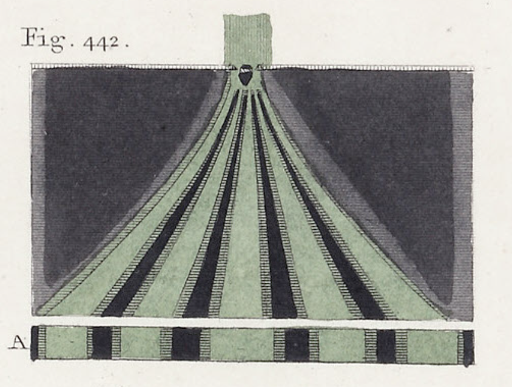
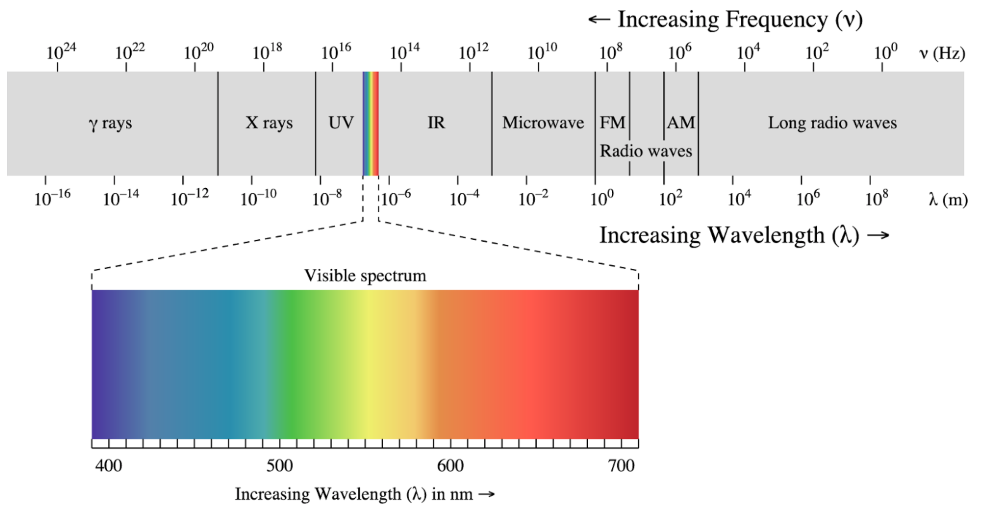
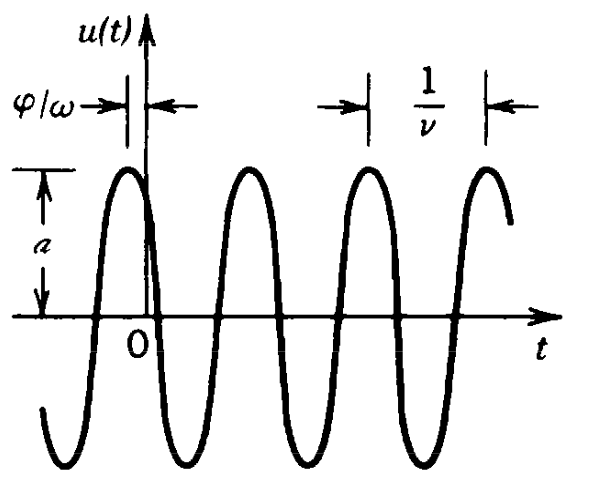
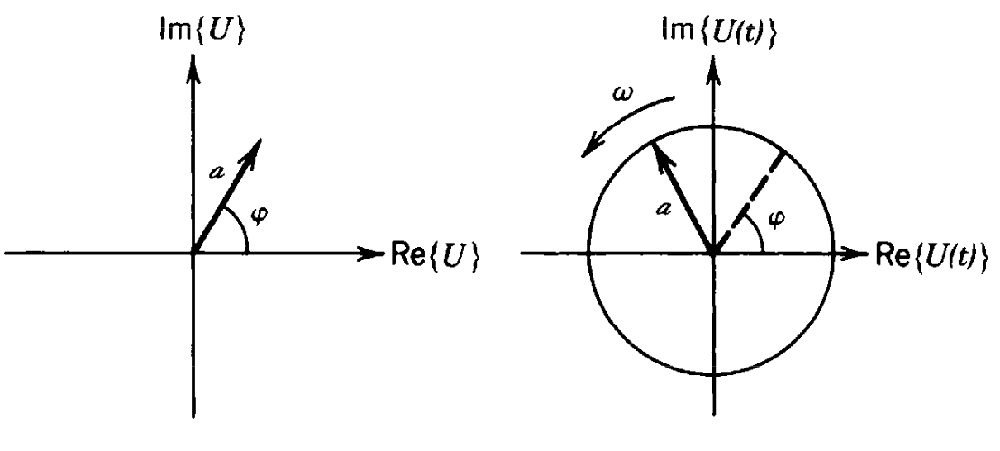
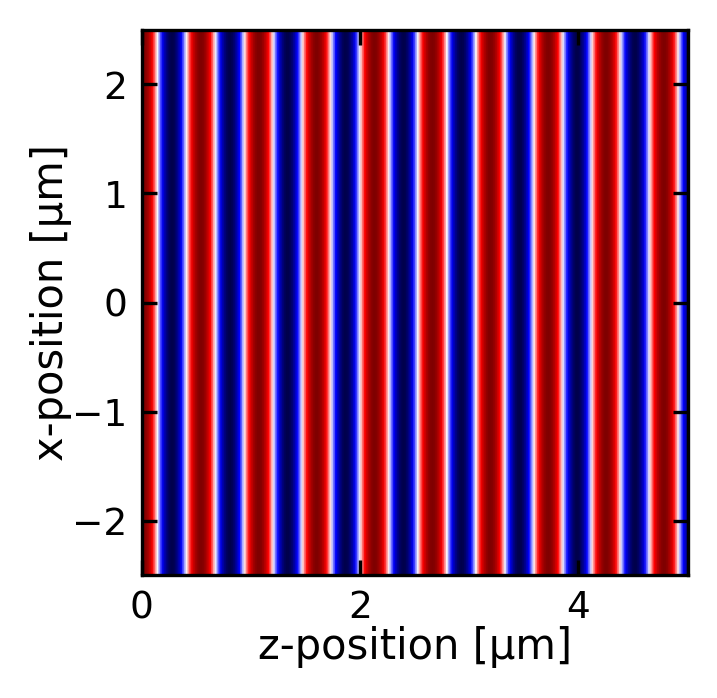
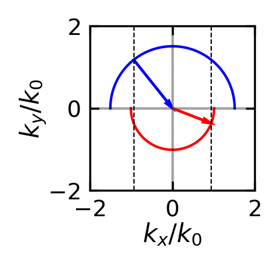
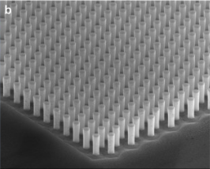
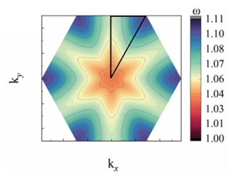
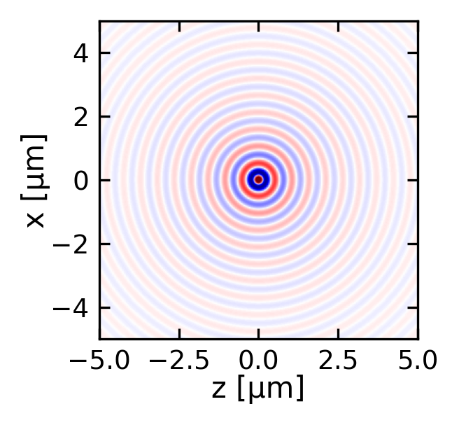
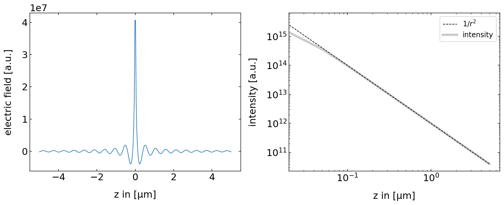

::: {.callout-note collapse="true"}
## Historical Development of Scalar Wave Optics

Wave optics represents a fundamental shift in our understanding of light's nature. Here are the key developments in its history:

**Ancient Times - 16th Century: Geometric Optics Dominance**
   - Ancient civilizations understood basic reflection and refraction.
   - Focus was primarily on ray-based descriptions of light.

**1660s: Robert Hooke's Wave Theory**
   - Proposed that light might be a rapid vibrational motion.
   - Observed interference effects in thin films ("Newton's Rings," though named later).

**1690: Christiaan Huygens' Wave Theory**
   - Published "Traité de la Lumière" (Treatise on Light).
   - Introduced the concept of wavefronts.
   - Developed principle for wave propagation (Huygens' Principle).

**1704: Newton's "Opticks"**
   - Despite observing interference effects, favored particle theory.
   - His authority led to wave theory being largely dismissed for nearly a century.

**1801: Thomas Young's Double-Slit Experiment**
   - Demonstrated interference of light definitively.
   - Measured wavelengths of different colors.
   - Introduced the concept of transverse waves.

   {width=50%}

**1818: Augustin-Jean Fresnel**
   - Developed comprehensive mathematical theory of diffraction.
   - Explained polarization through transverse waves.
   - Created Fresnel equations for reflection and refraction.
:::

Wave optics extends our understanding beyond the limitations of geometric optics by treating light as a wave phenomenon. This approach explains effects that cannot be accounted for by ray tracing alone, such as:

- Interference (the combination of waves)
- Diffraction (the bending of waves around obstacles or through apertures)
- Color (the wavelength-dependent nature of light)

Light is part of the electromagnetic spectrum, which spans an enormous range of frequencies. The visible region, extending approximately from 400 nm (violet) to 700 nm (red), represents only a small fraction of this spectrum. This wave description is essential for understanding many optical phenomena that geometric optics cannot explain, particularly when dealing with structures comparable in size to the wavelength of light.

::: {#fig-spectrum}
{width=70%}

Electromagnetic Spectrum with its different regions
:::

In the following, we would like to introduce wave by discarding the fact, that light is related to electric and magnetic fields. This is useful as the vectorial nature of the electric and magnetic field further complicates the calculations, but we do not need those yet. Accordingly we also do not understand how light really interacts with matter and we therefore have to introduce some postulates as well.

## Postulates of Wave Optics

::: {.callout-note}
## Wave

A wave corresponds to a physical quantity which oscillates in space and time. Its energy current density is related to the square magnitude of the amplitude.
:::

### Wave equation

$$
\nabla^2 u - \frac{1}{c^2}\frac{\partial^2 u}{\partial t^2}=0
$$

where the Laplace operator $\nabla^2$ is defined as:

$$
\nabla^2 =\frac{\partial^2}{\partial x^2}+\frac{\partial^2}{\partial y^2}+\frac{\partial^2}{\partial z^2}
$$

The wave equation is a linear differential equation, which implies that the superposition principle holds. Specifically, if $u_1(\mathbf{r},t)$ and $u_2(\mathbf{r},t)$ are solutions of the wave equation, then any linear combination:

$$
u(\mathbf{r},t)=a_1u_1(\mathbf{r},t)+a_2u_2(\mathbf{r},t)
$$

is also a solution, where $a_1$ and $a_2$ are arbitrary constants.

### Monochromatic Wave

A monochromatic wave consists of a single frequency $\omega$. By definition, such a wave must be infinite in time and free from phase disturbances (such as sudden jumps). The mathematical expression for a monochromatic wave is:

$$u(\mathbf{r},t)=a(\mathbf{r})\cos(\omega t + \phi(\mathbf{r}))$$

where:

- $a(\mathbf{r})$ represents the amplitude
- $\phi(\mathbf{r})$ represents the spatial phase
- $\omega$ represents the angular frequency

::: {#fig-wave}
{width=50%}

Representation of a wavefunction over time (constant position) denoting the phase $\phi$ and the period $T=1/\nu$
:::

#### Complex Amplitude

The wave can be represented in complex form as:

$$
U(\mathbf{r},t)=a(\mathbf{r})e^{i\phi(\mathbf{r})}e^{i\omega t}
$$

This is known as the complex wavefunction.

::: {#fig-complex-rep}
{width=70%}

Phasor diagram of the complex amplitude $U(\mathbf{r})$ (left) and $U(t)$ (right)
:::

::: {.callout-note}
A phasor displays the complex amplitude with magnitude and phase as a vector in the complex plane.
:::

The relationship between the complex and real wavefunctions is:

$$
u(\mathbf{r},t)=\text{Re}\{U(\mathbf{r},t)\}=\frac{1}{2}[U(\mathbf{r},t)+U^*(\mathbf{r},t)]
$$

The complex wavefunction satisfies the same wave equation:

$$
\nabla^2 U - \frac{1}{c^2}\frac{\partial^2 U}{\partial t^2}=0
$$

We can separate the complex wavefunction into spatial and temporal components:

$$
U(\mathbf{r},t)=U(\mathbf{r})e^{i\omega t}
$$

where

$$
U(\mathbf{r})=a(\mathbf{r})e^{i\phi(\mathbf{r})}
$$

Here, $\phi$ represents the spatial phase of the wavefunction. Substituting this into the wave equation and noting that the time derivatives bring down factors of $i\omega$:

$$\nabla^2 [U(\mathbf{r})e^{i\omega t}] - \frac{1}{c^2}\frac{\partial^2}{\partial t^2}[U(\mathbf{r})e^{i\omega t}] = 0$$
$$\nabla^2 U(\mathbf{r})e^{i\omega t} + \frac{\omega^2}{c^2}U(\mathbf{r})e^{i\omega t} = 0$$

The time dependence $e^{i\omega t}$ factors out, leaving us with **the Helmholtz equation**:

$$\nabla^2 U(\mathbf{r}) + k^2U(\mathbf{r}) = 0$$

where $k = \omega/c$ is the wave number. This equation describes the spatial behavior of monochromatic waves.

#### Intensity of Waves

The intensity of a wave at position $\mathbf{r}$ and time $t$ is defined as:

$$
I(\mathbf{r},t)=2\langle u^2(\mathbf{r},t)\rangle
$$

where $I$ is measured in units of $\left[\frac{W}{m^2}\right]$. The angle brackets $\langle \ldots \rangle$ represent a time average over one oscillation cycle of $u$. For visible light, this averaging occurs over an extremely brief period - for example, light with a wavelength of 600 nm has a cycle duration of just 2 femtoseconds.

The optical power $P$ of a wave can be calculated by integrating the intensity over a surface area $A$:

$$
P=\int_A I(\mathbf{r},t) \, dA
$$

Inserting the seperation of the complex wavefunction into spatial and temporal components leads to the following expression for the intensity:

$$
I(\mathbf{r})=|U(\mathbf{r})|^2
$$

Thus the physical quantity forming the spatial and temporal oscillation of the wavefunction is also providing the intensity of the wave when its magnitude is squared. This is a fundamental property of wavefunctions and for example not the case when temperature oscillates in space and time in a medium.

#### Wavefronts

Wavefronts are surfaces in space where the phase is constant:

$$
\phi(\mathbf{r})=\text{const}
$$

Typically, this constant is chosen to represent points of maximum spatial amplitude, such that:

$$
\phi(\mathbf{r})=2\pi q
$$

where $q$ is an integer.

The direction normal to these wavefronts can be described by the gradient vector:

$$
\mathbf{n}=\nabla\phi=\left(\frac{\partial \phi}{\partial x},\frac{\partial \phi}{\partial y},\frac{\partial \phi}{\partial z}\right)
$$

This vector $\mathbf{n}$ is always perpendicular to the wavefront surface and points in the direction of wave propagation. The evolution of these wavefronts in time provides important information about the wave's propagation characteristics.

## Plane Waves

A plane wave represents a fundamental solution of the homogeneous wave equation. In its complex form, it is expressed as:

\begin{equation}
U(\mathbf{r},t)=Ae^{-i\mathbf{k}\cdot \mathbf{r}}e^{i\omega t}
\end{equation}

where:

- The first exponential term contains the spatial phase
- The second exponential term contains the temporal phase
- $A$ is the (potentially complex) amplitude of the plane wave

The wavefront of a plane wave is defined by:

$$\mathbf{k}\cdot \mathbf{r}=2\pi q + \text{arg}(A)$$

where $1$ is an integer. It just means that the projection of the position vector $\mathbf{r}$ onto the wavevector $\mathbf{k}$ is a multiple of $2\pi$. This equation describes a plane perpendicular to the wavevector $\mathbf{k}$. Adjacent wavefronts are separated by the wavelength $\lambda=2\pi/k$, where $k$ represents the spatial frequency of the wave oscillation.

The spatial component of the plane wave is given by:

\begin{equation}
U(\mathbf{r})=Ae^{-i\mathbf{k}\cdot \mathbf{r}}
\end{equation}

In vacuum, the wavevector $\mathbf{k}=\mathbf{k}_0$ is real-valued and can be written as:

\begin{equation}
\mathbf{k}_0=
\begin{pmatrix}
k_{0x} \\
k_{0y}\\
k_{0z}\\
\end{pmatrix}
\end{equation}

::: {.cell execution_count=2}

::: {.cell-output .cell-output-display}
{width=358 height=349}
:::
:::

## Dispersion Relation

Using the plane wave solution

\begin{equation}
U(\mathbf{r},t)=Ae^{-i\mathbf{k}\cdot \mathbf{r}}e^{i\omega t}
\end{equation}

we can write down the sum of the spatial and temporal phase as

$$
\phi(r,t)=\omega t-\mathbf{k}\cdot \mathbf{r}
$$

If we select a point on the wavefront $\mathbf{r}_{m}$, and follow that over time, the phase $\phi(t)=\text{const}$. Taking the time derivative results in

$$
\mathbf{k}\cdot \frac{d\mathbf{r}_{m}}{dt}=\omega
$$

If we choose the direction of the wavevector for measuring the propagation speed, i.e. $\mathbf{r}_{m}=r_{m}\mathbf{e}_k$ then we find for the propagation speed

$$
\frac{dr_{m}}{dt}=\frac{\omega}{k}
$$

or in vacuum

\begin{equation}
c_0=\frac{\omega}{k_0}
\end{equation}

This fundamental relationship connects:

- The momentum ($k$),
- The energy ($\omega$)

and is called a dispersion relation despite the fact, that we do not really understand why those quantities are related to energy and momentum.

::: {.callout-note}
Light in free space exhibits a linear dispersion relation, i.e. the frequency of light changes linearly with the wavevector magnitude.
:::

Note that if we choose a different propagation direction $\mathbf{e}$ than the one along the wavevector $\mathbf{e}_k$, we can write the phase velocity as

$$
\mathbf{k}\cdot\mathbf{e} \frac{dr}{dt}=k\cos(\measuredangle\mathbf{k},\mathbf{e}) \frac{dr}{dt}=\omega
$$

or

$$
\frac{dr}{dt}=\frac{\omega}{k\cos(\measuredangle\mathbf{k},\mathbf{e})}
$$

which means that if you observe the wavepropagation not in the direction of the wavevector, the phase velocity is actually bigger than the speed of light and even tends to infinity if the angle between the wavevector and the observation direction tends to 90°.

## Propagation in a Medium

When a wave propagates through a medium:

1. The frequency $\omega$ remains constant (determined by the source)
2. The wave speed changes according to:
   $$
   c=\frac{c_0}{n}
   $$
   where $n$ is the refractive index of the medium

This leads to changes in:

- the wavelength, which becomes shorter in the medium
  $$
  \lambda=\frac{\lambda_0}{n}
  $$

- the length of the wavevector, which increases in the medium
  $$
  k=nk_0
  $$

::: {#fig-plane-prop .content-visible when-profile="default"}
{width=40%}

Propagating spherical waves for positive wavenumber.
:::

## Snells Law

The change in the length of the wavevector has some simple consequence for Snells law. We can write Snells law as

$$
n_1k_0\sin(\theta_1)=n_2k_0\sin(\theta_2)
$$

where $k_0$ is the wavevector length in vacuum. As the $n_1k_0$ is the magnitude of the wavevector in medium 1, and $n_2k_0$ is the magnitude of the wavevector in medium 2, we can rewrite Snells law as

$$
k_1\sin(\theta_1)=k_2\sin(\theta_2)
$$

which means that the component of the wavevector parallel to the interface is conserved. If the wavevector has constant length then the wavevector incident at different angles is between a point on a circle and the origin in the diagram below. The circle corresponds to an isofrequency surface.

::: {layout-ncol=3 column-width-left="40%" column-width-middle="20%" column-width-right="20%"}

::: {.cell execution_count=3}

::: {.cell-output .cell-output-display}
{width=232 height=220}
:::
:::

{width=90%}

{width=100%}
:::

Isofrequency surfaces can have non-spherical shape. In anisotropic media, they can be ellipsoids. In photonic crystals, i.e. crystals with a periodic structure on the scale of the wavelength, they can have a more complex shape.

## Spherical Waves

A spherical wave, like a plane wave, consists of spatial and temporal components, but with wavefronts forming spherical surfaces. For spherical waves, $|\mathbf{k}||\mathbf{r}|=kr=\text{const}$. Given a source at position $\mathbf{r}_0$, the spherical wave can be expressed as:

\begin{equation}
U=\frac{A}{|\mathbf{r}-\mathbf{r}_0|}e^{-ik|\mathbf{r}-\mathbf{r}_0|} e^{i\omega t}
\end{equation}

::: {.callout-important}
The $1/|\mathbf{r}-\mathbf{r}_0|$ factor in the amplitude is necessary for energy conservation - ensuring that the total energy flux through any spherical surface centered on the source remains constant.
:::

::: {.cell execution_count=4}

::: {.cell-output .cell-output-display}
{width=328 height=303 fig-align='center'}
:::
:::

::: {#fig-spherical-amplitude}
{width=100%}

Spherical wave amplitude and intensity of the spherical wave as a function of distance from the source
:::

The plots demonstrate that:

- The field amplitude decays rapidly with distance
- The intensity follows a $1/r^2$ law (with slight deviations at small distances due to discretization artifacts)

::: {#fig-spherical-propagation layout-ncol=2 .content-visible when-profile="default"}
{width=30%}

{width=30%}

Propagating spherical waves for positive wavenumber
:::

Note: The direction of wave propagation can be reversed by changing the sign of the wavenumber $k$.

